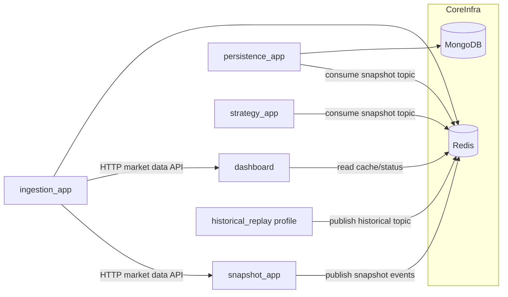
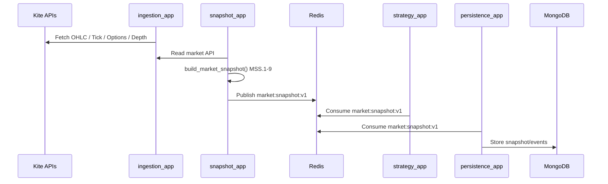
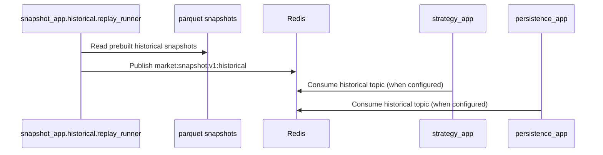

# BankNifty System Architecture (Current)

This is the canonical architecture document for the current repository state.

## 1) Principles

- Loose coupling by contract: services communicate via HTTP, Redis keys, and Redis pub/sub topics.
- `snapshot_app.market_snapshot.build_market_snapshot()` is the canonical MSS.1-MSS.9 builder.
- Live and historical streams are topic-isolated:
  - Live: `market:snapshot:v1`
  - Historical: `market:snapshot:v1:historical`
- Session-aware live runtime: work is active only during NSE market session (`09:15-15:30`, `Asia/Kolkata`).
- Fail closed on token/auth failures: no synthetic fallback in live mode.

## 2) Service Topology

## 3) Live Flow (Market Session)

## 4) Historical Flow (Replay)

## 5) Layer Mapping (Architecture v1.0 -> Services)

| Layer | Responsibility | Current Service/Module |
|---|---|---|
| L1 | Data source | `ingestion_app` (live), `snapshot_app.historical.replay_runner` (historical replay input) |
| L2 | MSS builder | `snapshot_app.market_snapshot` |
| L3 | Event bus | Redis topic pub/sub (`market:snapshot:v1*`) |
| L4 | Strategy engine | `strategy_app` |
| L5 | Execution/Persistence | `persistence_app` (storage), execution engine to be layered separately |
| L6 | Observability | dashboard + service health endpoints + `.run/*` logs |

## 6) Contracts

- Snapshot event contract: `contracts_app.events` (`event_type=market_snapshot`, `event_version=1.0`)
- Topic resolvers: `contracts_app.topics`
- Market session utilities: `contracts_app.market_session`
- Shared math helpers (dashboard): `contracts_app.options_math`

## 7) What To Read Next

1. [PROCESS_TOPOLOGY.md](/c:/code/market/PROCESS_TOPOLOGY.md) for exact run/start/stop commands.
2. Service docs:
   - [ingestion_app/README.md](/c:/code/market/ingestion_app/README.md)
   - [snapshot_app/README.md](/c:/code/market/snapshot_app/README.md)
   - [persistence_app/README.md](/c:/code/market/persistence_app/README.md)
   - [strategy_app/README.md](/c:/code/market/strategy_app/README.md)
3. Historical snapshot build guide:
   - [snapshot_app/historical/README.md](/c:/code/market/snapshot_app/historical/README.md)
