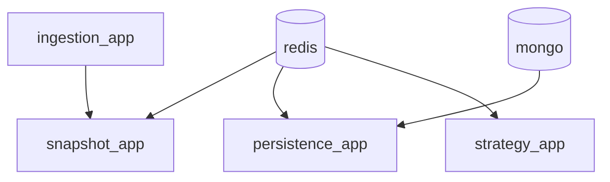

# Process Topology and Runbook

Run commands from repo root: `c:\code\market`

## 1) Choose One Start Path

Do not run both at once.

1. Docker Compose (recommended for production-like runtime)
2. Local Python launchers (recommended for development/debug)

## 2) Compose Runbook

### Baseline stack

```bash
docker compose --env-file .env.compose up -d --build redis mongo ingestion_app snapshot_app persistence_app strategy_app
```

### Add dashboard

```bash
docker compose --env-file .env.compose --profile ui up -d dashboard
```

### Run historical replay profile

```bash
docker compose --env-file .env.compose --profile historical up historical_replay
```

### Stop

```bash
docker compose --env-file .env.compose down --remove-orphans
```

## 3) Local Python Runbook

### Start all core + dashboard

```bash
python -m start_apps --include-dashboard
```

### Stop all

```bash
python -m stop_apps --include-dashboard
```

## 4) Per-Service Local Commands

### ingestion_app

```bash
python -m ingestion_app.main_live --mode live --start-collectors
python -m ingestion_app.main_live --mode live --start-collectors --foreground
python -m ingestion_app.health --api-base http://127.0.0.1:8004
python -m ingestion_app.stop
```

### snapshot_app

```bash
python -m snapshot_app.main_live --instrument BANKNIFTY26MARFUT
python -m snapshot_app.main_live --instrument BANKNIFTY26MARFUT --foreground
python -m snapshot_app.health --events-path .run/snapshot_app/events.jsonl --max-age-seconds 900
python -m snapshot_app.stop
```

### persistence_app

```bash
python -m persistence_app.main_snapshot_consumer
python -m persistence_app.main_snapshot_consumer --foreground
python -m persistence_app.health --max-age-seconds 900
python -m persistence_app.stop
```

### strategy_app

```bash
python -m strategy_app.main --engine deterministic --topic market:snapshot:v1
python -m strategy_app.health
python -m strategy_app.stop
```

## 5) Health and Ports

- Ingestion API: `http://127.0.0.1:8004/health`
- Dashboard health (if enabled):
  - Compose `ui` profile: `http://127.0.0.1:8008/api/health`
  - Local launcher (`start_apps`): `http://127.0.0.1:8002/api/health`
- Snapshot events file: `.run/snapshot_app/events.jsonl`
- Health exit codes: `0=healthy`, `1=degraded`, `2=unhealthy`

## 6) Runtime Topology (Compose Baseline)



## 7) Logs and Runtime Files

- `ingestion_app`: `.run/ingestion_app/{stdout.log,stderr.log,process.json,session_state.json}`
- `snapshot_app`: `.run/snapshot_app/{stdout.log,stderr.log,process.json,events.jsonl}`
- `persistence_app`: `.run/persistence_app/{stdout.log,stderr.log,process.json}`
- dashboard (local launcher): `.run/dashboard/{stdout.log,stderr.log,process.json}`
