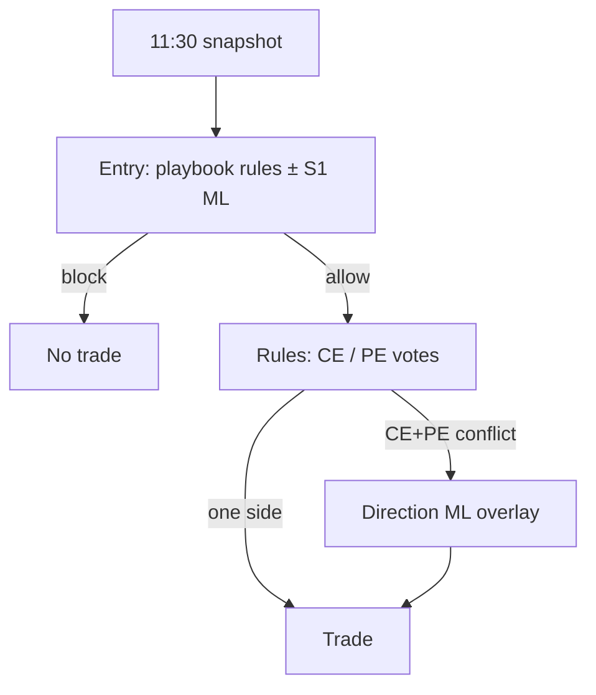

# Entry and direction — two-track training

## Runtime (sequential, exclusive layers)



1. **Entry** decides *whether* to trade (playbook primary; optional Stage-1 model later).
2. **Direction** decides *CE vs PE* only when rules disagree (`DIRECTION_ML_MODEL_PATH`).

Direction never overrides a blocked entry.

---

## Track A — Entry (do this first)

| Item | Path |
|------|------|
| Manifest | `ml_pipeline_2/configs/research/staged_dual_recipe.entry_s1_only_hpo_v1.json` |
| Launcher | `python -m ml_pipeline_2.scripts.run_entry_s1_only_hpo` |
| VM script | `ops/gcp/run_entry_s1_only_hpo_vm.sh` |
| Flags | `bypass_stage2`, `bypass_stage3`, `entry_only_publish` |
| Gates | `hard_gates.stage1` + `hard_gates.entry_only` (economic holdout) |

**Rules-only entry (no ML):** PBV1 rule matrices + deterministic eval replays — still the main production path until S1 HPO passes.

```bash
sudo docker compose ... down   # free RAM
sudo bash /opt/option_trading/ops/gcp/run_entry_s1_only_hpo_vm.sh
```

ETA ~1–2 h (oracle + S1 Optuna).

---

## Track B — Direction (after entry is acceptable)

| Item | Path |
|------|------|
| Manifest | `ml_pipeline_2/configs/research/staged_dual_recipe.direction_s2_only_hpo_v1.json` |
| Launcher | `python -m ml_pipeline_2.scripts.run_direction_s2_only_hpo` |
| VM script | `ops/gcp/run_direction_s2_only_hpo_vm.sh` |
| Export | `python -m ml_pipeline_2.scripts.export_direction_bundle_from_research --run-dir ...` |
| Runtime | `DIRECTION_ML_MODEL_PATH` → `strategy_app/ml/direction_ml_policy.py` |

```bash
sudo bash /opt/option_trading/ops/gcp/run_direction_s2_only_hpo_vm.sh
```

See also [DIRECTION_S2_ONLY.md](DIRECTION_S2_ONLY.md).

---

## Do not use for decoupled research

| Manifest | Problem |
|----------|---------|
| `direction_only_hpo_v1` | Still trains S1+S2+S3; combined gates → often 0 trades |
| `stage1_hpo.json` (legacy menu) | S1-focused HPO but **still runs S2+S3** |

---

## VM checklist

```bash
cd /opt/option_trading
sudo git pull --ff-only origin main
sudo docker compose --env-file .env.compose \
  -f docker-compose.yml -f docker-compose.gcp.yml down

# Track A (entry ML research)
sudo bash ops/gcp/run_entry_s1_only_hpo_vm.sh validate
sudo bash ops/gcp/run_entry_s1_only_hpo_vm.sh

# Track B (direction ML) — after A or in parallel if RAM allows (not both heavy jobs)
sudo bash ops/gcp/run_direction_s2_only_hpo_vm.sh validate
sudo bash ops/gcp/run_direction_s2_only_hpo_vm.sh
```

Unified host: [GCP_UNIFIED_VM.md](GCP_UNIFIED_VM.md).
