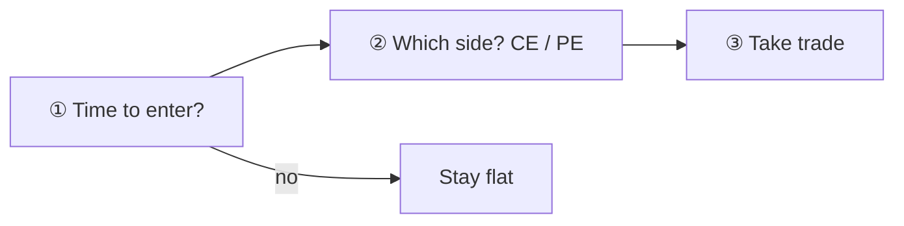
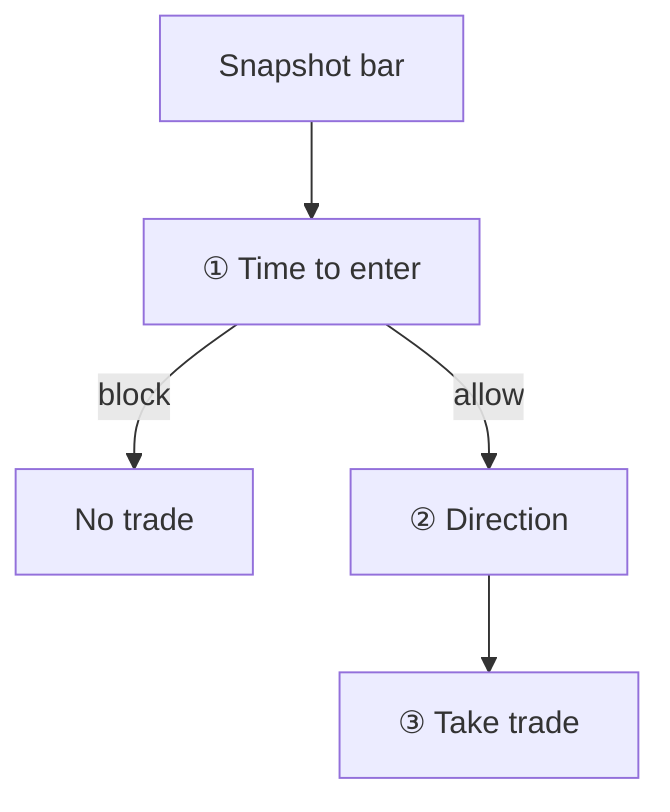

# Entry and direction — two-track training

## Canonical pipeline (3 steps)

Every trade should follow this order — **no step is skipped**:



| Step | Question | Output |
|------|----------|--------|
| **① Time to enter** | Is *now* a good moment? (move / setup / gates) | trade **yes** or **no** |
| **② Direction** | If yes, **up → CE** or **down → PE**? | one side |
| **③ Take trade** | Strike, premium, stops, exits attached | `TradeSignal` → position |

Later steps never run if an earlier step says no. Direction never overrides a blocked entry.

### How the repo implements each step

| Step | Target implementation | Today |
|------|----------------------|--------|
| **①** | S1 ML (`ENTRY_ML_*`) or playbook / IV / brain gates | `ML_ENTRY` + `IV_FILTER`, or rule entry votes + `PlaybookBrain` |
| **②** | Rules per setup, or S2 ML (`DIRECTION_ML_*`), or simple snapshot tie-break | `DIRECTION_ML_MODEL_PATH`, conflict resolver, or `fut_return_5m` / VWAP |
| **③** | `EntryPolicy` + strike selection + `trader_master` exits | `deterministic_rule_engine` → `TradeSignal` |

| Profile | Step ① | Step ② | Step ③ |
|---------|--------|--------|--------|
| **`trader_master_ml_entry_det_dir_v1`** (recommended experiment) | `ML_ENTRY` + `IV_FILTER` | **Rules** (ORB, OI, VWAP, composites, …) — majority on CE/PE conflict; snapshot tie-break if no rule vote | `trader_master` exits |
| `trader_master_ml_entry_v1` | `ML_ENTRY` only | Momentum or `DIRECTION_ML_MODEL_PATH` | same exits |
| `trader_master_v1` | Rule strategies (mixed ①+②) | Same votes; conflict → direction ML or **block** | same exits |

Patch VM for the experiment:

```bash
sudo bash ops/gcp/patch_trader_master_ml_entry_det_dir_env.sh
# STRATEGY_PROFILE_ID=trader_master_ml_entry_det_dir_v1
# Do not set DIRECTION_ML_MODEL_PATH
```

---

## Runtime detail (rule book vs ML entry)



- **Entry** = step ① (whether).
- **Direction** = step ② (CE vs PE); ML only required when rules disagree on side.

---

## Track A — Entry (do this first)

| Item | Path |
|------|------|
| Manifest (current) | `ml_pipeline_2/configs/research/staged_dual_recipe.entry_s1_only_hpo_v2.json` |
| Feature grid | `ml_pipeline_2/configs/research/staged_grid.entry_playground_v1.json` |
| Launcher | `python -m ml_pipeline_2.scripts.run_entry_s1_only_hpo` |
| VM script | `ops/gcp/run_entry_s1_only_hpo_vm.sh` |
| **Overnight (entry + direction)** | `ops/gcp/run_ml_playground_overnight_vm.sh` — see [ML_PLAYGROUND_OVERNIGHT.md](ML_PLAYGROUND_OVERNIGHT.md) |
| **S1 label** | `entry_bn_5m_100pts_v1` — within **5 min**, BN futures moves **≥100 points** in either direction; threshold as **% of price**: `100 / px_fut_close` (~0.20% at 50k) |
| Flags | `bypass_stage2`, `bypass_stage3`, `entry_only_publish` |
| Gates | `hard_gates.stage1` + `hard_gates.entry_only` (economic holdout uses recipe oracle returns) |

**Rules-only entry (no ML):** PBV1 rule matrices + deterministic eval replays — still the main production path until S1 HPO passes.

```bash
sudo docker compose ... down   # free RAM
sudo bash /opt/option_trading/ops/gcp/run_entry_s1_only_hpo_vm.sh
```

ETA ~1–2 h (oracle + S1 Optuna).

---

## Track B — Direction (after entry is acceptable)

| Item | Path |
|------|------|
| Manifest | `ml_pipeline_2/configs/research/staged_dual_recipe.direction_s2_only_hpo_v1.json` |
| Launcher | `python -m ml_pipeline_2.scripts.run_direction_s2_only_hpo` |
| VM script | `ops/gcp/run_direction_s2_only_hpo_vm.sh` |
| Export | `python -m ml_pipeline_2.scripts.export_direction_bundle_from_research --run-dir ...` |
| Runtime | `DIRECTION_ML_MODEL_PATH` → `strategy_app/ml/direction_ml_policy.py` |

```bash
sudo bash /opt/option_trading/ops/gcp/run_direction_s2_only_hpo_vm.sh
```

See also [DIRECTION_S2_ONLY.md](DIRECTION_S2_ONLY.md).

### Track B2 — Dual per-side direction (E3-S6, **on hold**)

Separate CE-win / PE-win binary models (`ce_win_v1`, `pe_win_v1`) exported as `direction_dual_bundle.joblib`. Code on `main`; **VM training resumed** after `min_abs_return` lowered to **0.001** (first run at 0.003 → 0 labeled rows).

| Item | Path |
|------|------|
| Manifests | `direction_dual_ce_hpo_v1.json`, `direction_dual_pe_hpo_v1.json` |
| VM script | `ops/gcp/run_direction_dual_hpo_vm.sh` |
| Export | `ml_pipeline_2/scripts/export_direction_dual_bundle.py` |
| Runtime patch | `ops/gcp/patch_trader_master_ml_entry_v1_dual_dir_env.sh` |
| Replay | `run_engine_direction_ab.sh v1_dual_direction_ml` |

**Use unified S2 bundle (Track B above) for eval until E3-S6 resumes.** Details: [SCRUM_BOARD_ML_ENTRY_DIRECTION.md](SCRUM_BOARD_ML_ENTRY_DIRECTION.md) E3-S6.

---

## Do not use for decoupled research

| Manifest | Problem |
|----------|---------|
| `direction_only_hpo_v1` | Still trains S1+S2+S3; combined gates → often 0 trades |
| `stage1_hpo.json` (legacy menu) | S1-focused HPO but **still runs S2+S3** |

---

## VM checklist

```bash
cd /opt/option_trading
sudo git pull --ff-only origin main
sudo docker compose --env-file .env.compose \
  -f docker-compose.yml -f docker-compose.gcp.yml down

# Track A (entry ML research)
sudo bash ops/gcp/run_entry_s1_only_hpo_vm.sh validate
sudo bash ops/gcp/run_entry_s1_only_hpo_vm.sh

# Track B (direction ML) — after A or in parallel if RAM allows (not both heavy jobs)
sudo bash ops/gcp/run_direction_s2_only_hpo_vm.sh validate
sudo bash ops/gcp/run_direction_s2_only_hpo_vm.sh
```

Unified host: [GCP_UNIFIED_VM.md](GCP_UNIFIED_VM.md).

---

## Experiment profiles — ML entry + trader_master exits

### ML entry + deterministic direction (`trader_master_ml_entry_det_dir_v1`)

| Item | Value |
|------|--------|
| Profile | `trader_master_ml_entry_det_dir_v1` |
| Step ① | `ML_ENTRY` must fire (`ENTRY_ML_*`) |
| Step ② | Regime-routed **rule** strategies (same book as `trader_master_v1`); `ML_ENTRY` vote ignored for side |
| Step ③ | Same exits/risk as `trader_master_v1` |
| Patch | `ops/gcp/patch_trader_master_ml_entry_det_dir_env.sh` |

### ML entry + momentum / direction ML (`trader_master_ml_entry_v1`)

| Item | Value |
|------|--------|
| Profile | `trader_master_ml_entry_v1` |
| Entry | **`ML_ENTRY` only** (+ `IV_FILTER` veto) — no ORB/PBV1/rule entry strategies |
| Exits / risk | Same as `trader_master_v1` (ORB, OI, composites, top-3, PBV1 exit helpers, trailing) |
| Export S1 | `python -m ml_pipeline_2.scripts.export_entry_bundle_from_research --run-dir ...` |
| Env | `ENTRY_ML_MODEL_PATH`, `ENTRY_ML_MIN_PROB` (default 0.55); optional `DIRECTION_ML_MODEL_PATH` for CE/PE |
| Patch VM | `ops/gcp/patch_trader_master_ml_entry_env.sh` |

Replay example:

```bash
# After export on VM:
sudo bash ops/gcp/patch_trader_master_ml_entry_env.sh
sudo docker compose ... build strategy_app_historical
sudo docker compose ... up -d --force-recreate strategy_app_historical
# historical eval with STRATEGY_PROFILE_ID=trader_master_ml_entry_v1
```

### OOS validation (ML_ENTRY primary voter — May 2026)

After commit `a133936`, validate on disjoint windows before tuning caps or TIME_STOP:

- **[SCRUM_BOARD_ML_ENTRY_DIRECTION.md](SCRUM_BOARD_ML_ENTRY_DIRECTION.md)** — stories, owners, results log (update each sprint)
- [BREAKTHROUGH_ML_ENTRY_PRIMARY_VOTER_2026-05-23.md](BREAKTHROUGH_ML_ENTRY_PRIMARY_VOTER_2026-05-23.md)
- [runbooks/OOS_VALIDATION_ML_ENTRY_PRIMARY_VOTER.md](runbooks/OOS_VALIDATION_ML_ENTRY_PRIMARY_VOTER.md)
- `sudo bash ops/gcp/run_oos_validation_replay.sh oos_primary`
