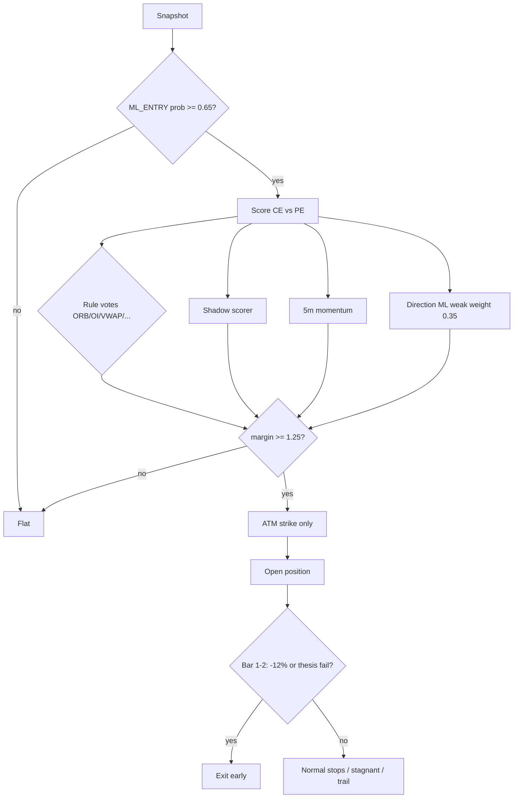

# Exit + risk experiments — May–Jul 2024 OOS (team runbook)

**Living document** — update the [results table](#results-scorecard) after each replay completes.  
**Last updated:** 2026-05-24  
**VM:** `option-trading-runtime-01` · zone `asia-south1-b` · checkout `/opt/option_trading`  
**Baseline reference run:** `ae5a86b7-9198-4e64-9399-fd5fea03e293` (profile `trader_master_ml_entry_v1` + direction ML, PF ≈ 1.0 on full window after throttle fix)

Related: [SCRUM_BOARD_ML_ENTRY_DIRECTION.md](SCRUM_BOARD_ML_ENTRY_DIRECTION.md) · [ENTRY_AND_DIRECTION.md](ENTRY_AND_DIRECTION.md) · [reports/FORENSICS_oos_primary_2024-05-07_ae5a86b7.md](reports/FORENSICS_oos_primary_2024-05-07_ae5a86b7.md)

---

## 1. What we are testing

| Layer | Question | Held constant |
|-------|----------|----------------|
| **Entry** | When to enter? | S1 `ML_ENTRY` model, `ENTRY_ML_MIN_PROB=0.65` |
| **Direction** | CE vs PE? | Varies by experiment (ML-only vs consensus) |
| **Exit / risk** | How to cut losers / hold winners? | Varies (stagnant bars, dyn_exit, thesis-fail) |
| **Harness** | Fair replay? | `patch_trader_master_eval_replay_env.sh`, consec=15, session_trades=12, emit 2400 snaps/min, drain ≥400 closes |

**Pass criteria (analyzer):** trades ≥ 40, portfolio PF ≥ 1.3, CE leg PF ≥ 1.0, PE leg PF ≥ 1.0.

---

## 2. How to run (Ops)

### One-shot experiment

```bash
cd /opt/option_trading
sudo git pull --ff-only origin main
sudo bash ops/gcp/run_exit_risk_experiments.sh E5   # or E1|E2|E2E3|E4|E5|all
```

### Background (long run)

```bash
sudo bash -c 'cd /opt/option_trading && nohup bash ops/gcp/run_exit_risk_experiments.sh E5 \
  > .run/exit_risk_experiments/nohup_E5.log 2>&1 &'
```

### Monitor

```bash
pgrep -af run_exit_risk || echo done
sudo tail -f /opt/option_trading/.run/exit_risk_experiments/E5_direction_consensus.log
# After run_id appears:
sudo grep -E 'queued|Profit factor|TIME_STOP|2024-07|OVERALL' \
  /opt/option_trading/.run/exit_risk_experiments/E5_direction_consensus.log
```

### After code change (`strategy_app`)

Per [GCP deploy workflow](../.cursor/rules/gcp-deploy-workflow.mdc): `git pull` → `docker compose build strategy_app_historical` → `up -d --force-recreate --pull never`.

### Logs and artifacts

| Path | Content |
|------|---------|
| `.run/exit_risk_experiments/<tag>.log` | Full replay + analyze output |
| `.run/exit_risk_experiments/run_ids.env` | `tag=run_id` lines |
| `.run/exit_risk_experiments/master.log` | Orchestrator timestamps |
| `.run/exit_risk_experiments/build.log` | Docker build |

---

## 3. Experiment matrix

| ID | Tag | Profile patch | Extra risk patch | What changes vs baseline |
|----|-----|---------------|------------------|---------------------------|
| **Ref** | baseline | `patch_trader_master_ml_entry_v1_direction_ml_env.sh` | eval replay | 12-bar stagnant TIME_STOP; ML picks CE/PE |
| **E1** | `E1_stagnant_20` | `patch_trader_master_ml_entry_v1_stagnant_20_env.sh` | — | `stagnant_exit_bars` 12→20 |
| **E2** | `E2_dyn_exit` | `patch_trader_master_ml_entry_v1_dyn_exit_env.sh` | — | Stagnant exit deferred if shadow still agrees |
| **E2E3** | `E2E3_dyn_exit_stress` | E2 patch | `patch_eval_risk_stress_env.sh` | E2 + `consec_losses=4` stress |
| **E4** | `E4_stagnant20_dyn_exit` | `patch_trader_master_ml_entry_v1_stagnant_20_dyn_exit_env.sh` | — | E1 + E2 combined |
| **E5** | `E5_direction_consensus` | `patch_trader_master_ml_entry_consensus_env.sh` | — | Direction consensus + veto; ATM-only; fast thesis-fail exit |

**Script:** `ops/gcp/run_exit_risk_experiments.sh`  
**Window:** 2024-05-01 → 2024-07-31 · **~23,412** snapshots emitted per run

---

## 4. Results scorecard

Fill **Run ID** from log line `queued … run_id=…` or `run_ids.env`.

| ID | Run ID | Trades | PF | Cap % | Jul % | TIME_STOP n | CE PF | PE PF | Status | Notes |
|----|--------|--------|-----|-------|-------|-------------|-------|-------|--------|-------|
| Ref | `ae5a86b7` | 541 | 1.00 | +0.2 | −19.7 | 339 | 1.36 | 0.79 | Done | Forensics: [report](reports/FORENSICS_oos_primary_2024-05-07_ae5a86b7.md) |
| E1 | `2b7cd0e7` | 491 | 1.03 | — | −16.2 | 230 | — | — | Done | Best TIME_STOP reduction |
| E2 | `32b01989` | 540 | **1.04** | +6.8 | **−15.0** | 318 | 1.42 | 0.81 | Done | **Best PF / Jul so far** |
| E2E3 | `cf5ce85a` | 309 | 1.02 | — | **−4.6** | 179 | — | — | Done | Thin book; risk_pause choke |
| E4 | `81d73382` | 484 | 1.03 | +6.9 | −19.2 | 219 | 1.27 | 0.89 | Done | Combo did not beat E2 |
| **E5** | _TBD_ | — | — | — | — | — | — | — | **In progress** | Started 2026-05-24 ~18:11 UTC; commit `013ae66` |

### How to refresh one row

```bash
RID=<run_id>
sudo docker exec -e MONGO_URL=mongodb://mongo:27017 option_trading-dashboard-1 \
  python /tmp/analyze_oos_validation_run.py "$RID" oos_E5  # script copied by run_exit_risk_experiments.sh
```

---

## 5. Findings (why we lose — E2 forensics)

**Best run so far:** E2 (`32b01989`), PF 1.04, +6.8% cap, Jul −15%.

| Metric | Value |
|--------|--------|
| Winners | ~221 / 540 (**41%**) |
| Losers | ~319 (**59%**) |
| Median trade | **−1.6%** |

**Loss drivers (priority order):**

1. **TIME_STOP** — 318 trades (59%), WR 22%, avg −3.8%, exit PF ~0.15  
2. **PE leg** — PF 0.81 vs CE 1.42  
3. **STOP_LOSS** — 68 trades, 0% WR, avg −24% (often wrong side vs BN 5m)  
4. **July** — gives back May/Jun gains (−15% cap on E2)

**Direction ML ceiling:** holdout AUC ~0.55 — not a training bug; weak signal for CE vs PE at entry bar. See scrum board strategic context.

**E5 hypothesis:** Do not let ML own direction; require multi-signal consensus; cut bad 5m theses in 1–2 bars; trade ATM only.

---

## 6. E5 — direction consensus profile (commit `013ae66`)

### Profile

`trader_master_ml_entry_consensus_v1`

### Pipeline



### Code map

| Component | Path |
|-----------|------|
| Consensus scoring + veto | `strategy_app/engines/direction_consensus.py` |
| ML timing-only vote | `strategy_app/engines/strategies/ml_entry.py` (`ML_ENTRY_DIRECTION_MODE=consensus`) |
| Engine entry path | `strategy_app/engines/deterministic_rule_engine.py` → `_process_entry_consensus` |
| Risk config | `strategy_app/engines/profiles.py` → `_TRADER_MASTER_ML_ENTRY_CONSENSUS_RISK_CONFIG` |
| Early / thesis exits | `strategy_app/position/tracker.py` |
| VM patch | `ops/gcp/patch_trader_master_ml_entry_consensus_env.sh` |

### Env knobs (`.env.compose`)

| Variable | Default | Meaning |
|----------|---------|---------|
| `ML_ENTRY_DIRECTION_MODE` | `consensus` | ML_ENTRY does not bind side |
| `DIRECTION_CONSENSUS_MIN_MARGIN` | `1.25` | CE−PE score gap required to trade |
| `DIRECTION_CONSENSUS_ML_WEIGHT` | `0.35` | Direction ML influence (lower = less ML) |
| `DIRECTION_CONSENSUS_RULE_WEIGHT` | `1.0` | Rule strategy vote weight |
| `DIRECTION_CONSENSUS_SHADOW_WEIGHT` | `1.0` | Shadow scorer weight |
| `DIRECTION_CONSENSUS_MOMENTUM_WEIGHT` | `0.75` | `fut_return_5m` weight |
| `STRATEGY_STRIKE_MAX_OTM_STEPS` | `0` | ATM only |
| `ML_ENTRY_DET_SKIP_BRAIN_GATE` | `true` | Skip brain for eval |

### Risk defaults (profile)

| Field | Value | Effect |
|-------|-------|--------|
| `thesis_fail_exit_bars` | 2 | After 2 bars, exit if thesis failed |
| `thesis_fail_min_mfe_pct` | 0.02 | “No run” if MFE < 2% |
| `thesis_fail_pnl_pct` | −0.08 | Exit if red enough |
| `early_stop_loss_bars` | 2 | Early window |
| `early_stop_loss_pct` | 0.12 | −12% premium stop in first 2 bars |
| `underlying_stop_pct` | 0.0015 | Tighter BN stop |
| `atm_strike_only` | true | Block OTM |

### Decision-trace blockers to watch (E5)

| Blocker | Meaning |
|---------|---------|
| `direction_consensus:unclear_margin<…` | Veto — side not clear |
| `direction_consensus:no_direction_signals` | No rule/shadow/momentum signal |
| `ml_timing_gate` | ML_ENTRY did not fire |
| `entry_phase` / `session_trade_cap` / `avoid_veto` | Unchanged harness gates |

---

## 7. Replay hygiene (do not skip)

| Issue | Fix |
|-------|-----|
| Thin replays (~35–54 trades) | `REPLAY_EMIT_SNAPS_PER_MIN=2400` (default in `queue_replay.py`) |
| Eval “completed” before Mongo drains | `wait_replay_closes.py` in Docker with `--min-closes 400 --stable-polls 8` |
| Stale consumer lock | `wait_historical_consumers.py clear --force` before replay |
| GHCR stale image | `docker compose build` + `up --pull never` after `git pull` |

---

## 8. Team ownership

| Area | Owner | Current focus |
|------|-------|----------------|
| Ops / GCP | _@name_ | E5 replay, results log, VM patches |
| Engine | _@name_ | Consensus path, thesis-fail exits, trap signals (E5-S1) |
| ML / research | _@name_ | Entry S1 HPO; trap labels (future); no more S2 HPO |
| Tech lead | _@name_ | Scorecard review, ship candidate (E2 vs E5) |

---

## 9. Recommended next steps

1. **Complete E5** — update [§4 scorecard](#4-results-scorecard); compare trade count (consensus may trade less), PF, Jul, `direction_consensus:*` blocker rate.  
2. **Ship candidate** — if E5 beats E2 on PF + Jul with ≥400 trades → patch production eval profile; else keep E2 exits + iterate consensus margin/weights.  
3. **Telemetry** — persist `direction_source` + consensus scores on votes (forensics still shows `NO_ML_VOTE_MATCH`).  
4. **Do not** invest in more unified direction ML HPO until trap/E5-S1 path tested.

---

## 10. Changelog

| Date | Change |
|------|--------|
| 2026-05-24 | Doc created; E1–E4 results; E5 started (`013ae66`); E2 forensics summary |
| | _Update run_id + metrics when E5 completes_ |
