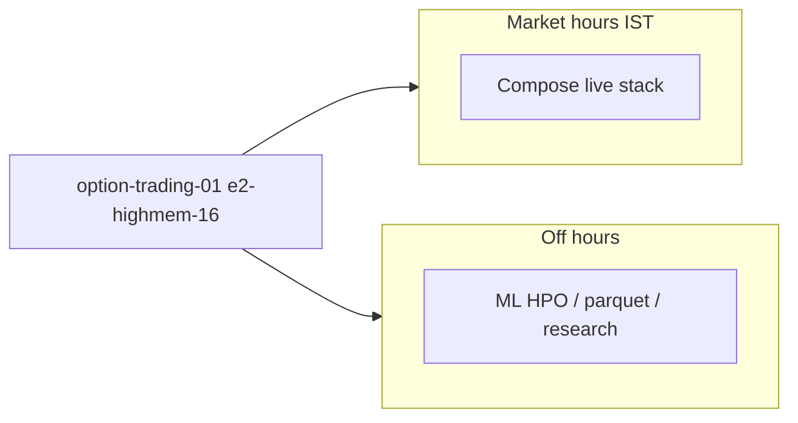

# GCP unified VM — analysis (runtime + ML on one host)

## Current production state (May 2026 cutover)

| VM | Status | Shape | Notes |
|----|--------|-------|-------|
| **`option-trading-runtime-01`** | **RUNNING** (unified host) | **`e2-highmem-8`** (8 vCPU, **64 GB**) | ML data at `/opt/option_trading/.data/ml_pipeline` (~4.2 GB parquet); `.venv` for off-hours HPO |
| `option-trading-ml-01` | **TERMINATED** (cost save) | `e2-highmem-8` | Decommissioned after GCS sync; start only to recover disk-only artifacts |

**`e2-highmem-16` blocked on trial:** global quota `CPUS_ALL_REGIONS` limit **12**; 16 vCPU resize failed while any other VM existed. Practical unified shape today is **`e2-highmem-8`** (8 CPUs, 64 GB RAM). Request quota bump for 16 vCPU / 128 GB if needed.

**Off-hours ML on unified host** (prefer decoupled direction — see [DIRECTION_S2_ONLY.md](DIRECTION_S2_ONLY.md)):

```bash
gcloud compute ssh option-trading-runtime-01 --zone=asia-south1-b --project=algo-trading-496203
sudo bash /opt/option_trading/ops/gcp/run_direction_s2_only_hpo_vm.sh validate
sudo bash /opt/option_trading/ops/gcp/run_direction_s2_only_hpo_vm.sh   # night/weekend only
```

GCS backup: `gs://algo-trading-496203-option-trading-snapshots/ml_pipeline/` (~4.4 GB).

---

## Why two VMs today (legacy)

| VM | Role | Shape before cutover |
|----|------|----------------------|
| `option-trading-runtime-01` | Live/historical compose, dashboard, Kite, Redis, Mongo | `e2-standard-4` (4 vCPU, 16 GB) → **`e2-highmem-8`** |
| `option-trading-ml-01` | Parquet, oracle, HPO | `e2-custom-4-6144` (6 GB) → `e2-highmem-8` → **stopped** |

Split made sense early: isolate ML memory spikes from live trading stack, scale lanes independently, smaller blast radius.

## Why one VM is reasonable now

- **Same repo path** — both lanes already use `/opt/option_trading` on GCP; duplicate checkouts add sync confusion.
- **Trial / quota** — one 16-vCPU box uses similar total CPU as 4+8 today; one bill, one SSH target.
- **Data locality** — parquet under `.data/ml_pipeline/parquet_data` is on ML today; runtime replays need it too (GCS sync or local copy). Unified disk removes cross-VM sync.
- **Ops** — single `git pull`, one resize decision, one monitoring surface.

## Risks of combining (mitigations)

| Risk | Mitigation |
|------|------------|
| ML oracle/HPO OOM or CPU starvation kills live stack | **Schedule**: heavy ML off-market hours; stop optional compose profiles during HPO (`ENABLE_HISTORICAL_PROFILE=0`, no eval grid). |
| Docker + Python peak RAM together | Target **≥64 GB**, prefer **128 GB** (`e2-highmem-16`). |
| Accidental training during market session | Document + agent rule: no `run_direction_only_hpo` / `run_research` 09:00–15:30 IST without user OK. |
| Single point of failure | Accept for trial/solo ops; add snapshots of `/opt/option_trading/.data` to GCS (already have bucket sync). |

## Memory budget (order of magnitude)

| Workload | Peak RAM |
|----------|----------|
| Redis + Mongo + core compose (ingestion, snapshot, strategy_app, dashboard) | 8–14 GB |
| Historical replay / eval profile (extra containers) | +4–8 GB |
| Oracle labeling (450k rows × 4 recipes) | 6–10 GB |
| Stage2 Optuna HPO (8 jobs, xgb/lgbm) | 4–12 GB |
| OS + page cache | 4 GB |

**Comfortable total:** 64 GB minimum for overlap; **128 GB** if you run replay + HPO same day without stopping compose.

## CPU budget

- Live tick + snapshot + dashboard: 2–4 vCPU sustained.
- Oracle + HPO: benefits from **8–16 vCPU** (`model_n_jobs=8` in manifests).
- **16 vCPU** unified host is a good match for “runtime by day, ML by night” or reduced compose during training.

## 16-vCPU options in `asia-south1-b` (trial-friendly)

`n2-highmem-8` was **unavailable** in this zone (May 2026). **E2 highmem** started successfully.

| Machine type | vCPU | RAM | Fit | Trial / availability |
|--------------|------|-----|-----|----------------------|
| **`e2-highmem-16`** (recommended) | 16 | 128 GB | Best balance: ML headroom + full compose | E2 family; same line as working `e2-highmem-8` |
| `e2-standard-16` | 16 | 64 GB | OK if cost-sensitive; schedule ML vs compose | Usually available |
| `n2-highmem-16` | 16 | 128 GB | Same RAM as e2-highmem-16, newer CPU | May hit `ZONE_RESOURCE_POOL_EXHAUSTED` (retry or other zone) |
| `c3d-highmem-16` | 16 | 128 GB | Alternative if E2/N2 exhausted | Newer; check quota on trial |
| `e2-highcpu-16` | 16 | 16 GB | **Avoid** — same OOM failure mode | Too little RAM |

**Not recommended for this project:** `n1-highcpu-16` (14 GB RAM), any 16-vCPU shape with ≤32 GB RAM.

## Suggested unified VM

```txt
Name:         option-trading-01   (or rename existing runtime VM after merge)
Zone:         asia-south1-b
Project:      algo-trading-496203
Machine type: e2-highmem-16
Disk:         500 GB+ pd-ssd (parquet + docker + artifacts)
Path:         /opt/option_trading
```

### Trial account notes

- Free trial credits apply to compute; **e2-highmem-16** is roughly ~\$0.90–1.10/hr in asia-south1 (check [GCP pricing](https://cloud.google.com/compute/all-pricing)).
- This project (May 2026): **`CPUS_ALL_REGIONS` limit = 12**, usage 8 with one `e2-highmem-8` running. **`e2-highmem-16` needs a quota increase** (and ML VM must stay stopped).
- Confirm:

```bash
gcloud compute project-info describe --project=algo-trading-496203 \
  --format="table(quotas.metric,quotas.limit,quotas.usage)" | findstr CPU
```

- **`option-trading-ml-01` is TERMINATED** after cutover — do not run both VMs on trial without stopping one first.
- First-time ML on runtime: `sudo apt install python3.10-venv` then `python3 -m venv .venv` + `pip install -e ml_pipeline_2` (see `ops/gcp/run_staged_release_pipeline.sh`).

## Migration sketch

1. **Resize or create** unified VM (`e2-highmem-16`).
2. Ensure `/opt/option_trading` has: git checkout, `.venv`, `.data/ml_pipeline`, docker, `.env.compose`.
3. **Rsync or GCS-sync** ML parquet/artifacts from old ML VM if not already on disk.
4. Point DNS/firewall/dashboard to unified host; verify `curl :8008/api/health`.
5. **Stop** `option-trading-ml-01` (or delete after backup).
6. Update `ops/gcp/operator.env`: single `VM_NAME=option-trading-01`.

## Operating model on one box



- **Day:** runtime lane — `docker compose` + dashboard; ML = light scripts only.
- **Night / weekend:** `run_direction_only_hpo` / `run_research`; optionally `docker compose stop` on non-essential services.

## Terraform / operator.env

See `infra/gcp/terraform.tfvars` — add optional unified mode:

```hcl
# unified_machine_type = "e2-highmem-16"
# use_single_vm        = true
```

Until Terraform is updated, resize via:

```bash
gcloud compute instances stop option-trading-01 --zone=asia-south1-b --project=algo-trading-496203
gcloud compute instances set-machine-type option-trading-01 \
  --machine-type=e2-highmem-16 --zone=asia-south1-b --project=algo-trading-496203
gcloud compute instances start option-trading-01 --zone=asia-south1-b --project=algo-trading-496203
```
