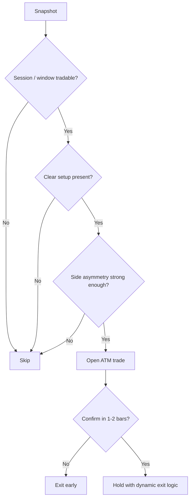

## Human-Style Strategy Spec

**Status:** design spec, not yet implemented end-to-end  
**Date:** 2026-05-25  
**Purpose:** translate current replay learnings into a more human, discretionary-style decision framework for the team to implement incrementally.

Related: `docs/HANDOVER_2026-05-22.md`, `docs/EXIT_RISK_EXPERIMENTS_2026-05.md`, `docs/ENTRY_AND_DIRECTION.md`

---

## 1. Why this spec exists

Current runs show a consistent pattern:

- `ML_ENTRY` has **some timing edge**
- CE side is materially better than PE in the best clean run
- `TIME_STOP` is still the main loss bucket
- direction ML is only slightly above coin-flip
- gross replay edge can disappear after realistic costs

That means the next system should think less like:

> "Predict CE or PE on every bar."

and more like:

> "Is this a clean, asymmetric setup? If yes, which side is safer? If not, do nothing."

This document defines that shift.

---

## 2. Design principles

### Principle 1: Skip is a first-class action

Most bars are not tradable. The engine should prefer:

- no trade over weak trade
- fewer trades over noisy trades
- asymmetric setups over symmetric guessing

### Principle 2: Context beats raw direction

Do not ask only:

- "up or down in 5 minutes?"

Ask first:

- is this an opening drive, failed move, reclaim, squeeze, or chop?
- who is trapped?
- is the market confirming or fading the thesis?

### Principle 3: Direction should be asymmetric

Current evidence says CE has more edge than PE in tested windows. The framework should allow:

- CE-first bias
- stricter requirements for PE
- separate vetoes by side
- optional PE disable in some regimes

### Principle 4: Confirmation must come fast

The current entry thesis is 5-minute oriented. A human trader would not hold a dead trade for 10-12 bars waiting for it to work. If the market does not confirm quickly:

- reduce conviction
- cut early
- do not let flat/no-run trades become `TIME_STOP` losers

### Principle 5: Net edge matters, not gross edge

A strategy that only survives gross replay assumptions is not ready. Any design should be judged on:

- net PF
- bootstrap lower bound
- robustness across windows

---

## 3. Human-style decision hierarchy

The engine should follow this order:

1. **Should we trade this session / window at all?**
2. **Is there a real setup, or just noise?**
3. **Which side has structural advantage?**
4. **Is the trade confirming quickly enough?**
5. **Should we hold, reduce, or exit?**

If an earlier answer is "no", later steps should not try to rescue the trade.

---

## 4. Proposed decision pipeline

---

## 5. Layer 1: Session and time-window filter

Human traders do not treat all times equally.

### Proposed windows

| Window | Human interpretation | Default behavior |
|--------|----------------------|------------------|
| 9:15-9:25 | discovery / noise / spread heavy | strict vetoes, reduced confidence |
| 9:25-10:00 | institutional move window | highest confidence |
| 10:00-11:15 | continuation / first real reversal | normal confidence |
| 11:15-13:15 | chop / decay risk | selective only |
| 13:15-14:00 | theta-heavy / mean-revert trap | strong caution |
| 14:00-15:00 | late directional move possible | normal, but cost-aware |

### Required implementation behavior

- low-quality windows should need stronger confluence
- high-quality windows can allow standard confluence
- some windows may be trade-disabled entirely in future experiments

---

## 6. Layer 2: Setup detection

The system should trade named setups, not generic direction guesses.

### Priority setup families

1. **Opening drive continuation**
2. **VWAP reclaim and hold**
3. **Failed breakdown / failed breakout**
4. **Trap / squeeze setup**
5. **Trend pullback continuation**

### Minimum requirement

A trade should only be allowed if at least one setup family is active and one confirming signal agrees.

### Example setup logic

#### CE example

- failed move below VWAP
- reclaim above VWAP
- ORB / regime not bearish
- PE pressure not expanding in line with downside
- shadow score supportive

#### PE example

- breakdown holds below VWAP / ORL
- downside is persistent, not just a spike
- PE move confirmed by structure, not just recent momentum
- stronger threshold than CE

---

## 7. Layer 3: Side selection

Direction should not be a single model output.

### Side council inputs

Use a weighted council of:

- price structure: ORB / VWAP / previous day levels
- trap signals: failed move, rejection, reclaim failure
- shadow score / rule composite
- short-horizon momentum
- optional ML direction score as a weak vote

### Human-style side rules

1. **If the council disagrees, skip**
2. **If CE and PE both look mediocre, skip**
3. **If CE has mild edge and PE has no strong edge, prefer CE**
4. **PE should need stronger evidence than CE until it proves otherwise**

### Current recommended asymmetry

Until PE proves itself:

- CE may trade with normal threshold
- PE should require one extra confirming condition
- or remain blocked in ship-gate experiments

---

## 8. Layer 4: Entry construction

### Entry constraints

- prefer **ATM only**
- avoid unnecessary OTM premium decay unless a setup explicitly justifies it
- use existing `ML_ENTRY` as timing gate, not full decision-maker

### Entry checklist

Open only if all are true:

1. entry timing gate passes
2. setup family is active
3. side council has clear winner
4. session/window is tradable
5. cost/risk context is acceptable

If any item is weak, skip.

---

## 9. Layer 5: Early confirmation

This is the most important behavioral change.

### Rule

If the trade thesis is 5-minute based, it must show life in 1-2 bars.

### What counts as confirmation

- positive MFE quickly
- side thesis still supported by shadow / structure
- market not immediately rejecting the entry area

### What counts as failure

- no run at all after 1-2 bars
- immediate reversal against the thesis
- setup invalidation (VWAP loss, failed reclaim, failed breakdown follow-through)

### Default action

- early stop or thesis-fail exit
- do not wait for stagnant `TIME_STOP`

---

## 10. Layer 6: Exit design

Current replays say static time-based exits are too expensive.

### Exit priorities

1. **invalidate quickly if wrong**
2. **protect capital first**
3. **let confirmed runners breathe**
4. **avoid holding dead trades**

### Exit stack

| Exit type | Purpose |
|-----------|---------|
| early stop | thesis wrong immediately |
| thesis-fail exit | no run / no confirmation |
| dynamic exit | supportive signals reverse |
| trailing exit | keep winners alive, protect profits |
| hard stop | catastrophic protection |

### Human-style interpretation

A human trader often exits because:

- "the market is not doing what it should by now"
- not only because "bar count reached 12"

That behavior should replace a large share of current `TIME_STOP` losses.

---

## 11. Side-specific policy

### CE policy

Current best candidate.

Allow CE when:

- council support is adequate
- session/window is not hostile
- price structure is not obviously bearish

### PE policy

Stricter than CE until proven.

Allow PE only when:

- downside structure is clean
- breakdown holds, not just spikes
- PE has stronger council margin than CE
- cost/risk still makes sense

### Default interim ship assumption

If forced to ship sooner:

- ship-gate on **CE-only**
- require PE to re-earn inclusion with evidence

---

## 12. Telemetry required

A human trader can explain why they took or skipped a trade. The system should too.

Persist:

- setup family selected
- side council component scores
- veto reason
- time-window bucket
- entry confirmation result within first 2 bars
- exit trigger reason
- direction source and confidence

Without this, debugging turns into guessing.

---

## 13. Experiment roadmap

### Immediate

1. **Gate 1:** CE-only ship gate (`E6`, `E6_aug_oct`)
2. **Gate 2:** net-cost overlay and bootstrap CI

### Next human-style experiments

3. **time-window weighting**
4. **trap / failed-move signals**
5. **stronger PE requirements**
6. **dynamic exit tied to setup invalidation**

### Do not prioritize yet

- more plain CE-vs-PE HPO on the same labels
- more consensus weight tuning without better context signals

---

## 14. Acceptance criteria for a human-style version

The design is working only if it produces:

1. fewer but cleaner trades
2. lower `TIME_STOP` share
3. better net PF, not just gross PF
4. lower July drawdown
5. explicit, explainable skip / take / exit reasons

Suggested thresholds for promotion:

- net PF >= 1.10 on a meaningful window
- bootstrap CI lower bound >= 1.00
- materially lower `TIME_STOP` count than E2
- no dependence on PE for profitability unless PE improves

---

## 15. Team execution notes

### Engine team

- implement setup-family tagging
- add time-window multiplier / veto logic
- promote early confirmation to first-class logic
- persist side-council telemetry

### ML team

- focus on trap / state labels, not raw direction labels
- help define regime / setup tags for evaluation
- validate cost-aware rather than gross-only promotion

### Ops / replay team

- keep fair replay hygiene
- compare windows, not only one month
- report net PF beside gross PF by default

---

## 16. Bottom line

The system should stop trying to be a machine that always predicts the next direction and start acting like a disciplined human trader that:

- waits for clean context
- prefers the side with structural edge
- skips unclear situations
- expects quick confirmation
- exits dead trades fast
- judges performance after costs

That is the intended direction for the next strategy iteration.
