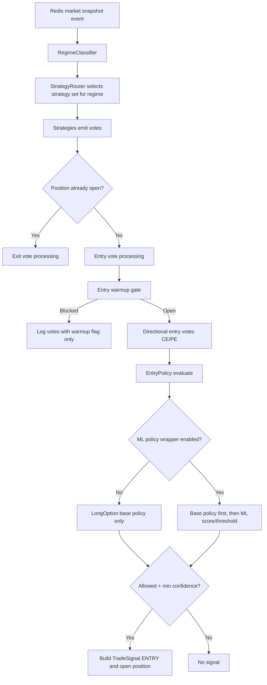
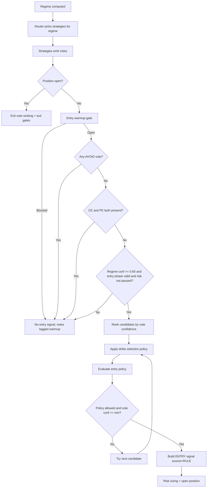
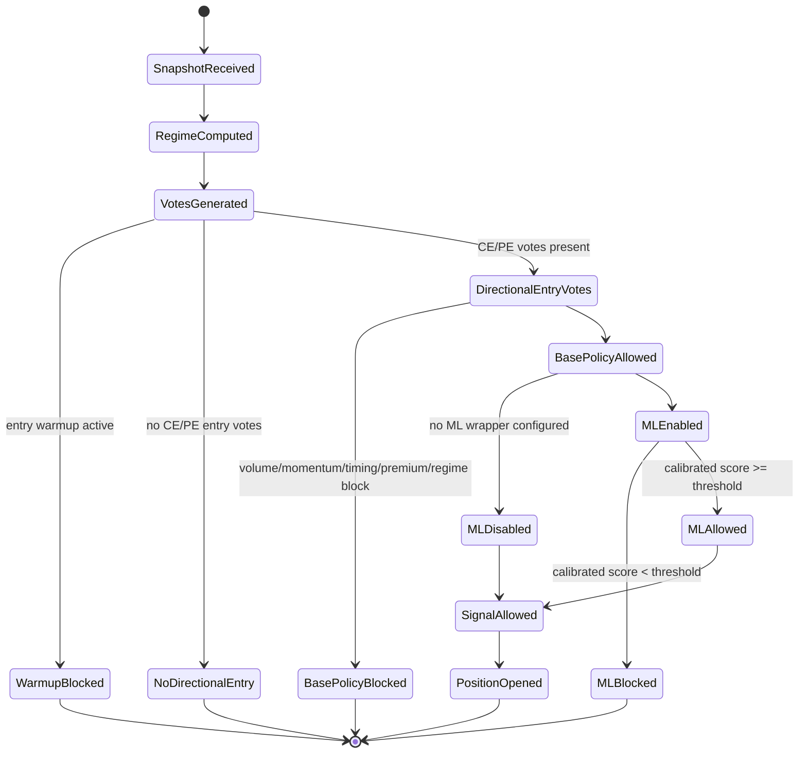

# ML Entry Gating Flow (Live Strategy)

This document explains how entry decisions are produced in live mode, where ML gating fits, and how to verify if ML is actually being applied.

## 0. Startup Artifact Verification (Operator)

Before interpreting live ML behavior, verify the runtime loaded the intended artifact.

### 0.1 What to verify at startup

At minimum, confirm all of the following are consistent:

- `experiment_id` (runtime)
- `bundle_path` (registry row)
- `threshold_policy_id` (registry + runtime override)
- `feature_profile_id` (registry row)
- calibration method and selected threshold (bundle/summary segment)

If you are using a side-specific threshold report, also verify:

- `trained_side`
- `ce_threshold`
- `pe_threshold`
- `runtime.block_expiry` for `ml_pure` lanes

### 0.2 Source of truth by field

- `feature_profile`: from registry column `feature_profile_id`
- `trained_side`: from side-specific threshold/metadata artifact (if present)
- `ce_threshold`, `pe_threshold`: from side-specific threshold report (if present)
- `calibration_method`: from bundle segment (`calibration_method`) and/or experiment summary (`selected_calibration_method`)
- `runtime.block_expiry`: from staged runtime policy or dual threshold report runtime block

### 0.3 Practical verification steps

1. Confirm startup line prints intended runtime ML config:
   - `ml_entry_experiment_id=...`
   - `ml_entry_threshold_policy=...`
2. Resolve the registry row for that `experiment_id` and verify:
   - `bundle_path`
   - `feature_profile_id`
   - `threshold_policy_id`
3. Inspect the bundle/summary artifact:
   - segment `threshold`
   - segment `calibration_method`
4. If `trained_side` / `ce_threshold` / `pe_threshold` are absent, you are not on a side-specific threshold artifact; use the selected segment threshold/calibration fields as the operative runtime values.
5. For `ml_pure` runtime, verify `runtime.block_expiry` explicitly. Current published defaults keep it `false`, so EXPIRY blocking is opt-in until changed by policy.

## 1. What Runs in Order

At runtime, the strategy app processes each snapshot in this order:

## 2. Trigger Logic By Layer

### 2.1 Regime classification

Regime is inferred from returns, volume ratio, OI change, PCR, and opening-range breaks.  
Example outcome reason:

- `TRENDING_BEAR: returns_aligned_down, pcr_bull=1.33, orl_broken`

### 2.2 Strategy vote generation

Each strategy emits a vote (or no vote).  
Example: `EMA_CROSSOVER` emits `ENTRY PE` when:

- `ema9 < ema21 < ema50`
- `close < ema9`
- spread is strong enough

Important: this is **alignment-based**, not a strict "fresh cross just happened" event.

### 2.3 Entry warmup

Even valid entry votes can be blocked by startup warmup:

- `STRATEGY_STARTUP_WARMUP_EVENTS`
- `STRATEGY_STARTUP_WARMUP_MINUTES`

Blocked votes get `_entry_warmup_blocked=true` in vote raw signals.

### 2.4 Base entry policy (deterministic)

If directional entry votes exist (CE/PE), base policy checks:

- volume (`vol_ratio`)
- momentum (`r5m`, `r15m`)
- timing (`minutes_since_open`)
- premium/IV
- regime allowance

Outputs:

- `_policy_allowed` true/false
- `_policy_reason` like `allowed score=0.54` or `timing: BLOCK:minutes=...`
- `_policy_checks` per-check results

### 2.5 ML policy wrapper (when enabled)

If ML entry policy is enabled:

1. Base policy runs first.
2. If base blocks, ML is not scored.
3. If base allows, ML computes calibrated score and compares threshold.

ML-specific check fields:

- `ml_segment`
- `ml_score_raw`
- `ml_score_calibrated`
- `ml_threshold`

Decision reason becomes:

- `ml: calibrated_score=... threshold=...` (allow), or
- `ml: calibrated_score=...<threshold=...` (block)

### 2.5a ML Pure expiry policy

`ml_pure` runtimes now expose `runtime.block_expiry` in their runtime config:

- dual path: threshold report `runtime.block_expiry`
- staged path: staged runtime policy `runtime.block_expiry`

Behavior:

- `false` (current default): ML paths may trade on `EXPIRY` if their learned thresholds pass
- `true`: both `ml_pure_dual` and `ml_pure_staged` hold on `EXPIRY` before entry scoring

This keeps the choice explicit instead of leaving expiry handling to undocumented engine divergence.

### 2.6 How strategies and gates work together (actual runtime precedence)

This is the practical precedence used in `DeterministicRuleEngine`:

1. Regime is computed first.
2. Router selects the strategy set for that regime.
3. Strategies emit votes independently for the same snapshot.
4. If a position is already open, engine runs **exit path** first.
5. If no position is open, engine runs **entry path** only when:
   - risk is not halted
   - regime map allows entry
6. Entry warmup gate runs before policy/ML:
   - if blocked, directional entry votes are tagged with `_entry_warmup_blocked=true` and no entry signal is produced
7. If any strategy emitted `AVOID`, entry is vetoed immediately.
8. Direction conflict gate:
   - if both CE and PE entry votes exist in same snapshot, entry is blocked.
9. Regime confidence gate:
   - blocks when regime confidence `< 0.60`.
10. Session/risk pause gate:
    - blocks when snapshot is outside valid entry phase or risk manager is paused.
11. Candidate ranking and per-candidate gating:
    - directional votes are sorted by vote confidence (high to low)
    - strike can be adjusted (for example `oi_volume_ranked`)
    - entry policy evaluates candidate (base or ML-wrapped policy)
    - candidate must pass both:
      - `candidate.confidence >= min_confidence`
      - `policy_decision.allowed == true`
12. The first candidate that passes produces the entry signal.
13. Signal source remains `RULE` even if ML was part of gate decision.
14. Exactly one action per snapshot is emitted (or none).

### 2.7 Strategy interaction map

In `TRENDING`, router runs:

- `IV_FILTER`
- `ORB`
- `EMA_CROSSOVER`
- `OI_BUILDUP`
- `PREV_DAY_LEVEL`

Interaction rules:

- `IV_FILTER` can veto all entries via `direction=AVOID`.
- Multiple entry strategies can agree on same direction; best-confidence candidate is attempted first.
- If strategies disagree on direction (some CE, some PE), engine blocks that snapshot (conflict gate).
- Policy/ML is applied per candidate in rank order; first passing candidate wins.
- During an open position, engine switches to exit-universal strategy set and resolves exit priority by owner/priority/confidence.

### 2.8 Calibration Reliability Note (C-01)

`ml_score_calibrated` should be treated as operationally conditional until calibration fix **C-01** is resolved.

- Current caveat: calibrated scores may be in-sample optimistic.
- Current caveat: threshold selection may not be walk-forward validated.
- Operator implication: an ML allow/block decision that depends on calibrated score is not yet equivalent to fully out-of-sample confidence.

Use this interpretation in production review:

- prioritize directional consistency and gate behavior over absolute calibrated value
- track ML gate effectiveness metrics (especially block-rate) rather than score magnitude alone

## 3. Why "Recent Signals" Often Looks Non-ML

`Recent Signals` is signal-level output. It does not carry full gate internals.  
ML evidence primarily appears in **vote policy checks**.

Signal source remains `"RULE"` by design, even when ML gate is active, because ML acts as an entry filter/quality gate on rule candidates.

## 4. Real Examples

### Example A: March 6, 2026, 12:32 IST (your confusion case)

Observed:

- `EMA_BEAR: close=58580 ema9=58615 ema21=58645 ema50=58672`
- `_policy_reason=allowed score=0.54`
- no `ml_*` check keys on those votes
- current ML-enabled strategy runtime started later at `2026-03-06 13:52:18 IST`

Interpretation:

- Entry came from base deterministic policy path.
- That specific event was not ML-scored.

### Example B: March 2, 2026, 12:45 IST (ML-scored vote)

Observed vote had:

- `_policy_reason=ml: calibrated_score=0.6396 threshold=0.6000`
- checks included `ml_segment`, `ml_score_raw`, `ml_score_calibrated`, `ml_threshold`

Interpretation:

- Base checks passed first, then ML scored and approved the entry.

## 5. Verification Checklist

Use this order to verify ML is working:

1. Confirm runtime startup line includes ML experiment and threshold policy.

## 6. Engine Lanes and Promotion Outputs (v2.3)

- Runtime lanes are explicit: `deterministic|ml|ml_pure` via `engine_mode`.
- Decision path is explicit: `rule_vote|ml_gate|ml_dual` via `decision_mode`.
- Promotion reporting is lane-specific:
  - `promotion_ladders.ml_pure` (Stage A/B driven; Stage C non-blocking)
  - `promotion_ladders.deterministic` (strategy replay utility constraints)
  - `promotion_decision.primary_lane` defaults to `ml_pure`
- Cross-lane scores are warning-only unless the same holdout window is used.
2. Check latest directional votes for `_policy_reason` and `_policy_checks`.
3. Confirm presence of `ml_score_calibrated` in vote checks.
4. Cross-check that signal was emitted only when policy allowed.

## 6. Dashboard ML Panel (new)

The live monitor now exposes an **ML Gate Monitor** panel that shows:

- status summary (`ML_ACTIVE_TODAY`, `NO_DIRECTIONAL_ENTRY_VOTES_TODAY`, etc.)
- day counts:
  - directional entry votes
  - policy-evaluated votes
  - base-allowed votes
  - ML-scored votes
  - ML-allowed votes
  - ML-blocked votes
  - warmup-blocked votes
- gate ratios:
  - `ML scored / base-allowed`
  - `ML block rate (of ML scored)`
- latest ML decision (today and overall)
- recent policy decisions with mode tags:
  - `ML` (ML-applied)
  - `BASE` (deterministic/base policy only)

Operational interpretation:

- `ML scored / base-allowed` near `100%` means ML is being invoked consistently on candidates that passed base policy.
- `ML block rate` near `0%` for long periods indicates ML may be rubber-stamping base policy rather than acting as a meaningful gate.

## 7. Decision-State Diagram

## 8. Engine Lanes And Promotion Ladder (v2.3)

Promotion is now lane-specific and reported independently:

- `ml_pure` lane:
  - driven by futures Stage A/B gates
  - Stage C remains diagnostic and non-blocking
- `deterministic` lane:
  - driven by deterministic strategy replay utility summary (baseline comparator)

Publishing outputs include:

- `promotion_ladders.ml_pure`
- `promotion_ladders.deterministic`
- `promotion_decision.primary_lane=ml_pure`

Operator note: lane outcomes are not directly comparable unless the same holdout window and replay scope are used.
