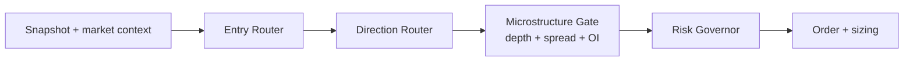

# Multi-Model Routing Strategy (Entry + Direction + Depth)

## Why this exists

We should stop treating model wiring as a single-path swap (`model A` -> `model B`).
Runtime should support multiple specialists at once so we can:

- keep one stable primary model live,
- run challengers in shadow mode,
- combine deterministic and ML decisions safely,
- add option-depth / microstructure context without rewriting the core engine.

---

## Target architecture



Hard rule:

1. Entry must pass.
2. Direction must pass.
3. Depth/microstructure must pass.
4. Risk governor must pass.
5. Only then place trade.

This keeps behavior deterministic and auditable even with many model calls.

---

## Model roles (recommended)

Use explicit roles instead of ad-hoc model paths.

| Role | Purpose | Trading authority |
|------|---------|-------------------|
| `entry_primary` | Main live entry model (today: likely E5) | Yes |
| `entry_shadow_1` | Challenger model (today: E3 candidate) | No (log only) |
| `entry_shadow_2` | Future challenger | No (log only) |
| `direction_primary` | Deterministic/rules or ML direction | Yes |
| `direction_shadow` | Alt direction model | No (log only) |
| `depth_gate` | Liquidity quality gate | Veto / size scaler |

---

## Decision contract (runtime)

Each component should output structured fields (same schema every tick):

- `entry_prob`, `entry_threshold`, `entry_pass`
- `direction_up_prob`, `direction_selected_side`, `direction_pass`
- `depth_quality_score`, `depth_pass`, `depth_reason`
- `risk_pass`, `risk_reason`
- `final_action` (`TRADE` / `HOLD`)
- `final_reason_codes` (list)
- `active_model_ids` (which model versions were used)

Final decision:

```text
TRADE if entry_pass AND direction_pass AND depth_pass AND risk_pass
else HOLD
```

---

## How to run multiple entry models safely

Do **not** fire a trade because "any model says yes".

Phase approach:

1. **Primary + shadow**
   - Trade only primary.
   - Log shadow scores and counterfactual decisions.
2. **Promotion**
   - Promote shadow to primary only if it wins for N sessions on:
     - net return,
     - max drawdown,
     - slippage-adjusted quality,
     - trade count sanity.
3. **Optional blending later**
   - Only after stable evidence, add weighted blend or regime switch.

---

## Direction strategy: deterministic + ML

Recommended hierarchy:

1. deterministic rules choose side when confidence is clear;
2. ML direction resolves ambiguous/conflict cases;
3. if both uncertain, hold.

This keeps deterministic continuity while still extracting ML edge.

---

## Option depth / extra data strategy

Use depth as a **gate**, not as standalone alpha initially.

Depth checks (examples):

- spread within allowed band,
- minimum top-of-book size,
- imbalance not extreme against selected side,
- estimated slippage below threshold.

If depth is weak:

- either hold,
- or reduce size by a deterministic multiplier.

---

## Config blueprint (example)

```yaml
router:
  entry:
    primary: e5_entry_only_v1
    shadows: [e3_velocity_v1]
    threshold_mode: static
  direction:
    primary: deterministic_v1
    shadow: direction_ml_v2
    conflict_policy: deterministic_then_ml
  depth:
    gate_id: depth_guard_v1
    mode: veto_or_size_reduce
  risk:
    governor_id: runtime_risk_v1
    max_daily_dd_pct: -0.75
    halt_consecutive_losses: 3
```

---

## Operator decision (May 2026) — entry ML only, no direction ML

**Confirmed:** direction ML (S2 / `DIRECTION_ML_MODEL_PATH`) is **not** used — it underperformed and is not wired for live.

| Step | What runs | What does *not* run |
|------|-----------|-------------------|
| **① Enter?** | **Entry ML only** (up to 3 published S1 models) | No ORB/OI/PBV1/rule entry strategies |
| **② CE or PE?** | **`ML_ENTRY_DIRECTION_MODE=composite`** (default): momentum + VWAP + VIX + IV skew + OR traps + PCR + **live depth** (book imbalance, microprice, bid/ask dom) | No `DIRECTION_ML_MODEL_PATH`, no rule-book direction votes. Set `ML_ENTRY_DIRECTION_MODE=momentum` for 5m-only fallback |
| **③ Trade** | Strike, premium, `trader_master` exits, risk | — |
| **Gate** | Depth (spread/book), optional IV extreme veto | Depth is not “direction” |

### Three entry models (E1 / E3 / E5 family)

| Role | Candidate | Notes |
|------|-----------|--------|
| **Live primary** | **E6** (current) until E5 wins shadow scorecard | Do not swap live without replay proof |
| **Challenger A** | **E5** (short train window) | Best PF among E1/E3/E5 ablations |
| **Challenger B** | **E3** (velocity features) | Shadow / promotion candidate |

**Policy:** trade on **one** primary entry model; run the other two in **shadow** (log prob + counterfactual). Do **not** enter because “any of three said yes” until an ensemble rule is coded and backtested.

### Runtime profile and env (target)

```text
STRATEGY_PROFILE_ID=trader_master_ml_entry_v1
ENTRY_ML_MODEL_PATH=<published E5 or E6 entry_only_bundle.joblib>
ENTRY_ML_MIN_PROB=0.55–0.65
# Do NOT set DIRECTION_ML_MODEL_PATH
ML_ENTRY_DIRECTION_MODE=composite     # default: multi-signal + depth (not direction ML)
DEPTH_FEED_ENABLED=1                  # required for depth leg of composite
# Optional tuning: ENTRY_DIR_W_DEPTH, ENTRY_DIR_MIN_MARGIN, ENTRY_DIR_W_MOMENTUM_5M, ...
```

**Not** `trader_master_ml_entry_det_dir_v1` (adds ORB/OI rule strategies for direction).  
**Not** `debit_multi_v1` for ML-entry experiments (that profile is rule playbooks: long CE/PE only).

`IV_FILTER` remains a **veto** on extreme IV, not an entry-timing model. To drop it, use a profile/map with `ML_ENTRY` only (future profile tweak).

### Code gap (today)

`ML_ENTRY` loads **one** bundle via `ENTRY_ML_MODEL_PATH`. Running all three entry models in one process needs either:

1. **Shadow workers** (recommended): primary in `strategy_app`, shadows in offline replay / sidecar scorer, or  
2. **`ENTRY_ML_MODEL_PATHS`** (comma-separated) + ensemble rule in `ml_entry.py` (not implemented yet).

---

## Promotion scorecard (minimum)

Promote shadow only if all are true over a fixed observation window:

- net return >= primary,
- max drawdown <= primary,
- profit factor >= primary (or within tolerance with lower DD),
- trade count within acceptable bounds (no collapse / no explosion),
- no risk rule violations increase.

If not, keep as shadow and continue data collection.

---

## Non-goals (for now)

- No **direction ML** in production (`DIRECTION_ML_MODEL_PATH` unset).
- No rule-book entry (ORB, PBV1, etc.) when profile is `trader_master_ml_entry_v1`.
- No “any model says enter” without a defined ensemble + replay proof.
- No depth-only autonomous entry logic.

Keep the first implementation simple, explicit, and easy to debug.
