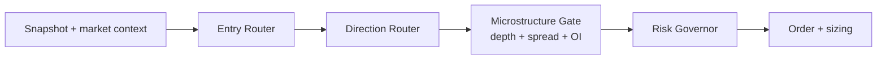

# Multi-Model Routing Strategy (Entry + Direction + Depth)

## Why this exists

We should stop treating model wiring as a single-path swap (`model A` -> `model B`).
Runtime should support multiple specialists at once so we can:

- keep one stable primary model live,
- run challengers in shadow mode,
- combine deterministic and ML decisions safely,
- add option-depth / microstructure context without rewriting the core engine.

---

## Target architecture



Hard rule:

1. Entry must pass.
2. Direction must pass.
3. Depth/microstructure must pass.
4. Risk governor must pass.
5. Only then place trade.

This keeps behavior deterministic and auditable even with many model calls.

---

## Model roles (recommended)

Use explicit roles instead of ad-hoc model paths.

| Role | Purpose | Trading authority |
|------|---------|-------------------|
| `entry_primary` | Main live entry model (today: likely E5) | Yes |
| `entry_shadow_1` | Challenger model (today: E3 candidate) | No (log only) |
| `entry_shadow_2` | Future challenger | No (log only) |
| `direction_primary` | Deterministic/rules or ML direction | Yes |
| `direction_shadow` | Alt direction model | No (log only) |
| `depth_gate` | Liquidity quality gate | Veto / size scaler |

---

## Decision contract (runtime)

Each component should output structured fields (same schema every tick):

- `entry_prob`, `entry_threshold`, `entry_pass`
- `direction_up_prob`, `direction_selected_side`, `direction_pass`
- `depth_quality_score`, `depth_pass`, `depth_reason`
- `risk_pass`, `risk_reason`
- `final_action` (`TRADE` / `HOLD`)
- `final_reason_codes` (list)
- `active_model_ids` (which model versions were used)

Final decision:

```text
TRADE if entry_pass AND direction_pass AND depth_pass AND risk_pass
else HOLD
```

---

## How to run multiple entry models safely

Do **not** fire a trade because "any model says yes".

Phase approach:

1. **Primary + shadow**
   - Trade only primary.
   - Log shadow scores and counterfactual decisions.
2. **Promotion**
   - Promote shadow to primary only if it wins for N sessions on:
     - net return,
     - max drawdown,
     - slippage-adjusted quality,
     - trade count sanity.
3. **Optional blending later**
   - Only after stable evidence, add weighted blend or regime switch.

---

## Direction strategy: deterministic + ML

Recommended hierarchy:

1. deterministic rules choose side when confidence is clear;
2. ML direction resolves ambiguous/conflict cases;
3. if both uncertain, hold.

This keeps deterministic continuity while still extracting ML edge.

---

## Option depth / extra data strategy

Use depth as a **gate**, not as standalone alpha initially.

Depth checks (examples):

- spread within allowed band,
- minimum top-of-book size,
- imbalance not extreme against selected side,
- estimated slippage below threshold.

If depth is weak:

- either hold,
- or reduce size by a deterministic multiplier.

---

## Config blueprint (example)

```yaml
router:
  entry:
    primary: e5_entry_only_v1
    shadows: [e3_velocity_v1]
    threshold_mode: static
  direction:
    primary: deterministic_v1
    shadow: direction_ml_v2
    conflict_policy: deterministic_then_ml
  depth:
    gate_id: depth_guard_v1
    mode: veto_or_size_reduce
  risk:
    governor_id: runtime_risk_v1
    max_daily_dd_pct: -0.75
    halt_consecutive_losses: 3
```

---

## Operator decision (May 2026) — entry ML only, no direction ML

**Confirmed:** direction ML (S2 / `DIRECTION_ML_MODEL_PATH`) is **not** used — it underperformed and is not wired for live.

| Step | What runs | What does *not* run |
|------|-----------|-------------------|
| **① Enter?** | **Entry ML only** (up to 3 published S1 models) | No ORB/OI/PBV1/rule entry strategies |
| **② CE or PE?** | **`ML_ENTRY_DIRECTION_MODE=composite`** (default): momentum + VWAP + VIX + IV skew + OR traps + PCR + **live depth** (book imbalance, microprice, bid/ask dom) | No `DIRECTION_ML_MODEL_PATH`, no rule-book direction votes. Set `ML_ENTRY_DIRECTION_MODE=momentum` for 5m-only fallback |
| **③ Trade** | Strike, premium, `trader_master` exits, risk | — |
| **Gate** | Depth (spread/book), optional IV extreme veto | Depth is not “direction” |

### Three entry models (E1 / E3 / E5 family)

| Role | Candidate | Notes |
|------|-----------|--------|
| **Live primary** | **E6** (current) until E5 wins shadow scorecard | Do not swap live without replay proof |
| **Challenger A** | **E5** (short train window) | Best PF among E1/E3/E5 ablations |
| **Challenger B** | **E3** (velocity features) | Shadow / promotion candidate |

**Policy:** trade on **one** primary entry model; run the other two in **shadow** (log prob + counterfactual). Do **not** enter because “any of three said yes” until an ensemble rule is coded and backtested.

### Runtime profile and env (target)

```text
STRATEGY_PROFILE_ID=trader_master_ml_entry_v1
ENTRY_ML_MODEL_PATH=<published E5 or E6 entry_only_bundle.joblib>
ENTRY_ML_MIN_PROB=0.55–0.65
# Do NOT set DIRECTION_ML_MODEL_PATH
ML_ENTRY_DIRECTION_MODE=composite     # default: multi-signal + depth (not direction ML)
DEPTH_FEED_ENABLED=1                  # required for depth leg of composite
# Optional tuning: ENTRY_DIR_W_DEPTH, ENTRY_DIR_MIN_MARGIN, ENTRY_DIR_W_MOMENTUM_5M, ...
```

**Not** `trader_master_ml_entry_det_dir_v1` (adds ORB/OI rule strategies for direction).  
**Not** `debit_multi_v1` for ML-entry experiments (that profile is rule playbooks: long CE/PE only).

`IV_FILTER` remains a **veto** on extreme IV, not an entry-timing model. To drop it, use a profile/map with `ML_ENTRY` only (future profile tweak).

### Code gap (today)

`ML_ENTRY` loads **one** bundle via `ENTRY_ML_MODEL_PATH`. Running all three entry models in one process needs either:

1. **Shadow workers** (recommended): primary in `strategy_app`, shadows in offline replay / sidecar scorer, or  
2. **`ENTRY_ML_MODEL_PATHS`** (comma-separated) + ensemble rule in `ml_entry.py` (not implemented yet).

---

## Promotion scorecard (minimum)

Promote shadow only if all are true over a fixed observation window:

- net return >= primary,
- max drawdown <= primary,
- profit factor >= primary (or within tolerance with lower DD),
- trade count within acceptable bounds (no collapse / no explosion),
- no risk rule violations increase.

If not, keep as shadow and continue data collection.

---

## Non-goals (for now)

- No **direction ML** in production (`DIRECTION_ML_MODEL_PATH` unset).
- No rule-book entry (ORB, PBV1, etc.) when profile is `trader_master_ml_entry_v1`.
- No “any model says enter” without a defined ensemble + replay proof.
- No depth-only autonomous entry logic.

Keep the first implementation simple, explicit, and easy to debug.

---

## Complete pluggable design (target state)

This section defines a production-ready plugin architecture that is measurable,
auditable, and safe to roll out in stages.

### Component interfaces (contracts)

Each component must implement a small, typed contract:

```text
interface EntryPlugin:
  evaluate(snapshot, context) -> EntryDecision

interface DirectionPlugin:
  evaluate(snapshot, context, entry_decision) -> DirectionDecision

interface StrikePlugin:
  select(snapshot, context, entry_decision, direction_decision) -> StrikeDecision

interface DepthPlugin:
  evaluate(snapshot, depth_context, direction_decision, strike_decision) -> DepthDecision

interface RiskPlugin:
  evaluate(snapshot, position, decisions...) -> RiskDecision
```

Decision objects must be immutable, include:

- `pass` boolean
- numeric score/probability
- `reason_codes` list
- `diagnostics` map (`str -> scalar`)
- `plugin_id` and `plugin_version`

### Pipeline orchestration

Runtime executes deterministic stage order:

1. Entry
2. Direction
3. Strike
4. Depth gate
5. Risk gate
6. Signal emit

Hard fail-fast:

- if any stage returns `pass=false`, downstream stages may still run in shadow
  mode for telemetry, but no trade is emitted.

### Plugin registry and config

Use one registry plus config, not hardcoded if/else in engine:

```yaml
runtime:
  plugins:
    entry:
      active: entry_primary_v1
      shadows: [entry_e5_shadow, entry_e3_shadow]
    direction:
      active: direction_composite_v1
      shadows: [direction_momentum_v1]
    strike:
      active: strike_confidence_iv_v1
    depth:
      active: depth_guard_v1
    risk:
      active: risk_governor_v1
```

Each plugin is selected by ID and version; registry resolves implementation.

### Data parity modes (must be explicit)

Every run must declare one of:

- `parity_mode=live_full` (snapshot + depth + all side channels)
- `parity_mode=replay_snapshot_only` (no depth side channel)
- `parity_mode=replay_full` (snapshot + replayed depth)

Never compare results across parity modes without labeling them.

---

## Measurability framework (what must be logged)

For each snapshot tick, persist one `decision_trace` record:

- run metadata: `run_id`, `profile_id`, `parity_mode`, `trade_date`
- stage outputs:
  - `entry.*`
  - `direction.*`
  - `strike.*`
  - `depth.*`
  - `risk.*`
- final output:
  - `final_action`, `final_reason_codes`
- plugin identities:
  - `entry_plugin_id/version`, etc.

For each open/close trade:

- entry snapshot id and full stage decisions at entry
- exit reason code
- realized `pnl_pct`, `mfe_pct`, `mae_pct`, `bars_held`

### Mandatory scorecards

Compute these per run and per regime:

- return: `net_pct`, `gross_pos`, `gross_neg`, `profit_factor`
- quality: `win_rate`, `avg_win`, `avg_loss`, `expectancy`
- risk: `max_dd`, `loss_tail_p95`, `consecutive_losses_max`
- behavior: `trade_count`, side mix (`CE/PE`), average hold bars
- execution proxy: average spread/relative spread at entry (if available)
- gate diagnostics: rejection rates by stage and reason code

### Direction-specific scorecard

Measure direction as a classifier on executed entries:

- `direction_win_rate_overall`
- `direction_win_rate_by_side` (CE, PE)
- `direction_edge_vs_baseline` (composite minus momentum on same entries)
- source attribution:
  - top signal tokens by support (`n`) and contribution to pnl
  - contradiction frequency (e.g. momentum CE vs depth PE)

---

## Acceptance criteria (promotion gates)

A candidate plugin/version can be promoted only if all pass over a fixed window
(minimum 5 sessions and minimum 40 trades unless market was abnormally quiet):

1. `net_pct` >= baseline
2. `max_dd` <= baseline
3. `profit_factor` >= baseline - tolerance(0.05)
4. `trade_count` within [0.7x, 1.3x] of baseline (unless explicitly intended)
5. no increase in risk-policy violations
6. parity-consistent behavior (no dependence on unavailable replay-only data)

If any fail: keep as shadow.

---

## Strike policy design (decoupled, pluggable)

Direction and strike must stay separate.

`strike_confidence_iv_v1`:

- inputs: side, entry confidence, IV percentile, spread proxy, strike step
- outputs: `selected_strike`, `mode` (`atm`, `otm_1`, `hold`)

Default logic:

- high IV percentile above reject threshold -> `hold`
- high confidence + IV below ceiling -> `otm_1`
- else -> `atm`

This plugin must emit `selected_strike_reason` and be A/B testable.

---

## Implementation roadmap (small deployable slices)

1. **Slice A: Contracts + trace schema**
   - Add decision objects and per-stage trace fields.
2. **Slice B: Registry + config wiring**
   - Resolve plugin IDs from config/env.
3. **Slice C: Strike plugin activation for ML entry path**
   - Remove hard ATM coupling from ML entry vote.
4. **Slice D: Replay depth parity**
   - Feed `market_depth_ticks` into sim side-channel.
5. **Slice E: Promotion automation**
   - Auto-generate scorecards and pass/fail gates.

Each slice must ship with regression tests and one reproducible sim replay.
