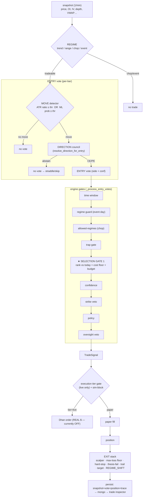

# System Flow — the clean, complete picture

> **Read this first.** One plain-English map of how a BankNifty bar becomes (or
> doesn't become) a trade: the data, the gates, the two councils, the exit, and how
> it's recorded. If another doc disagrees, this + [ENGINE_DECISION_FLOW.md](ENGINE_DECISION_FLOW.md)
> win. Detail docs are linked at each step.

---

## 1. The 30-second mental model

Every minute a **snapshot** arrives. The engine asks, in order:

1. **What kind of day is it?** (regime) — chop/event → don't trade.
2. **Is there a move worth catching right now, and can it pay for itself?** (entry + selection)
3. **Which side — and does the desk agree?** (direction council) — if not, abstain.
4. **Final safety checks** (confidence / strike / policy) → **trade**.
5. **Manage & exit** (separate stack).
6. **Record it** so the inspector shows exactly why.

Real money is **OFF** (paper). The whole thing is a funnel: ~375 bars/day → a handful (often **0–1**) of trades. Abstaining is the default.

---

## 2. The full flow (diagram)

---

## 3. The gates, one by one

Two kinds: **eliminators** (absolute yes/no) and the one **selection** gate (relative to today).

| # | Gate | Type | Fires / blocks when | Config key | Default |
|---|---|---|---|---|---|
| — | **Regime** | classifier | classifies the day; CHOP/PANIC → empty strategy list | profile map | live |
| 1 | Time window | eliminator | outside the trade window | `ENTRY_TIME_WINDOWS` | 09:45–15:00 |
| 2 | Regime guard | eliminator | opening range too wide (event day) | `REGIME_GUARD_MAX_ORW` | off (0) |
| 3 | Allowed-regimes (chop) | eliminator | bar's regime not in allow-list | `ENTRY_ALLOWED_REGIMES` | off (all) |
| 4 | Trap gate | eliminator | too few "trap" cues | `ENTRY_TRAP_GATE_ENABLED` | off |
| — | **MOVE detector** | eliminator | ATR ratio < thr (or ML prob < thr) | `ENTRY_VOL_GATE_ENABLED` / `ATR_ENTRY_MIN_PCT` (0.00088) · or `ENTRY_ML_MIN_PROB` | ATR gate on |
| **5** | **★ Selection Gate 1** | **selection** | bar not top-percentile of *today* **or** expected move < cost floor **or** daily budget hit | `OPPORTUNITY_GATE_ENABLED` | off (new) |
| 6 | Confidence | eliminator | vote confidence < min | `STRATEGY_MIN_CONFIDENCE` | 0.65 |
| 7 | Strike veto | eliminator | strike fails IV/depth checks | (strike policy) | live |
| 8 | Policy | eliminator | risk/policy block | (policy config) | live |
| 9 | Oversight veto | eliminator | LLM/brain veto | `BRAIN_OVERSIGHT_GATE_ENABLED` | off (shadow) |
| — | **Execution tier** | eliminator | only `tier==live` reaches Dhan; `sim-*` blocked | `EXECUTION_REQUIRE_LIVE_TIER` | real $ OFF |

**Why a selection gate (≠ the old ATR cliff):** a fixed `ATR ≥ 0.00088` "knows tomorrow's volatility today" — on a quiet day it fires 0. The selection gate ranks each bar **relative to today** and only fires the day's best that also clear the **~108pt cost floor** (≤3/day). Detail: [strategy_platform/OPPORTUNITY_GATE_DESIGN.md](strategy_platform/OPPORTUNITY_GATE_DESIGN.md).

---

## 4. The two councils (where the real decisions are made)

### 4a. ENTRY / move — "is there a move, and is it worth it?"
Members (de-correlated), ranked **relative to today** + cost floor:
- **ATR ratio** (always available, robust backbone) · **rolling entry model prob** (sharper) · volume · straddle expansion.
- Verdict: move-detection works (served AUC ~0.78) **≈ ATR** (corr 0.92) — it was never the bottleneck.

### 4b. DIRECTION — "which side, and does the desk agree?" (`ML_ENTRY_DIRECTION_MODE`)
The trader-checklist `checklist` mode (`_regime_council_direction`):
1. **Regime gate:** only bet directionally in a **trend** (price decisively off VWAP **and** 5-min momentum agrees). Range/chop → **abstain** (straddle/skip).
2. **Confluence council:** de-correlated members vote CE/PE *only when confident* — **vwap · straddle · PCR** (+ optional **direction model**, + **max_pain** advisory). **Anti-signals (momentum, ORB) are excluded.** Require **≥ `DIR_COUNCIL_MIN_AGREE` agree and outvote dissent**, else abstain.
- Other modes: `composite` (weighted blend, code default), `regime_dual` (**current live** — RegimeDirector + brain), `conviction_ensemble`, `momentum`.
- **Verdict: direction is THE wall.** Single members ~coin-flip; the only repeatable edge is **vwap+OI/max_pain+PCR agreement on big moves → ~59–62%** (thin, non-stationary). Plain ML direction = 53% / 57% on its confident 31%. Detail: [strategy_platform/DIRECTION_STRATEGY_SYNTHESIS.md](strategy_platform/DIRECTION_STRATEGY_SYNTHESIS.md).

---

## 5. Exit stack (separate from entry/direction)
Once open, the **exit policy stack** decides the close — entry/direction have zero say:
`scalper · max-loss floor 10% · hard-stop 7% · thesis-fail (5 bar) · trail · premium target · REGIME_SHIFT`.
Known weakness: **MFE giveback** — a winner that fades can exit (often via `REGIME_SHIFT`) *after* surrendering its peak (e.g. the Jun-11 trade went +2.2% → exited −0.22%).

---

## 6. Config — one source (don't get confused)
**All config = `.env.compose`**, applied with `docker compose --env-file .env.compose up -d`.
Behaviour variants = **profiles** (`ops/profiles/{prod,shadow}.env`), switchable; SIM runs the same profile file (`ops/run_sim_profile.sh`). Full rules + diagrams: **[strategy_platform/CONFIG.md](strategy_platform/CONFIG.md)**.

---

## 7. How a trade is recorded (so the inspector shows *why*)
Each bar persists: **snapshot + entry vote (with council `raw_signals`) + position + decision trace** → mongo → trade inspector. The inspector links **position.`entry_snapshot_id` ↔ vote.`snapshot_id`** to show the true chain (regime → council votes → side → exit). *(If you ever see "synthetic fallback / no entry vote linked", the vote wasn't persisted — fixed for the OPS-SIM 2026-06-16.)*

---

## 8. Current state (2026-06-16)
- **Live:** `strategy_app` healthy, `ML_ENTRY_DIRECTION_MODE=regime_dual`, ATR vol gate on, **paper** (`execution_app` down → **no real money**).
- **Shadow profile** (`checklist` council + Selection Gate 1) = validated in SIM, switchable, paper.
- **Images rebuilt** → code/config baked in (no more docker-cp fragility); deploy = build + `--env-file up`.
- **Honest verdict:** entry/move = solved-ish (≈ATR); **direction + cost = the wall**; selling premium remains the only proven +EV path. Real money stays OFF until a direction edge survives forward, on the current regime.

---

## 9. Where to look (code map)
| Thing | File |
|---|---|
| Engine + gates | `strategy_app/engines/deterministic_rule_engine.py` (`_process_entry_votes`, `_opportunity_gate_blocks`) |
| Direction councils | `strategy_app/engines/strategies/entry_direction_policy.py` (`resolve_direction_for_entry`, `_regime_council_direction`) |
| Selection gate | `strategy_app/engines/opportunity.py` |
| Entry strategies | `strategy_app/engines/strategies/{ml_entry,vol_gate_entry}.py` |
| Exits | `strategy_app/position/exit_policy.py` |
| Sim + persistence | `market_data_dashboard/routes/ops_routes.py` |
| Trade inspector | `market_data_dashboard/real_source.py` |
| Config | `.env.compose`, `ops/profiles/*`, `docs/strategy_platform/CONFIG.md` |
