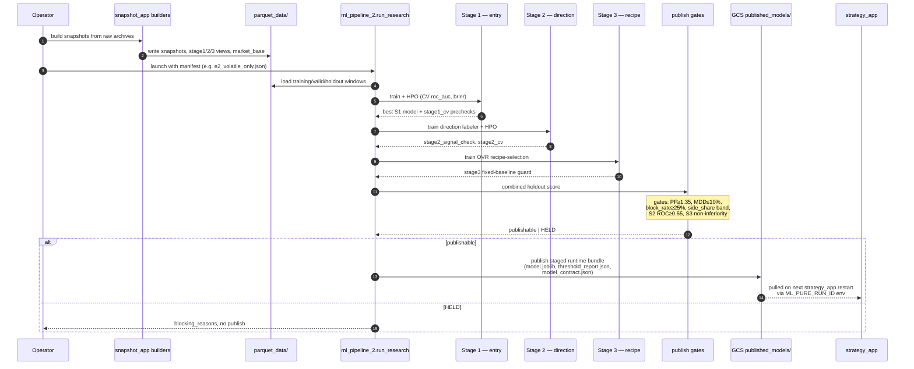
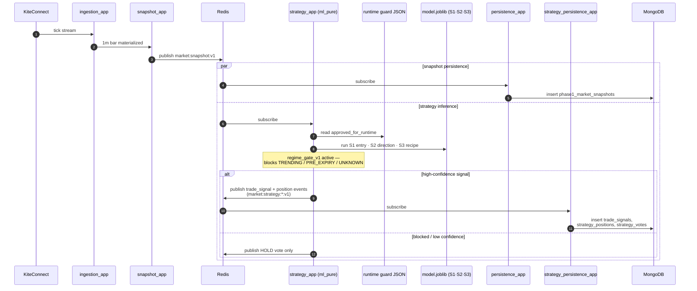
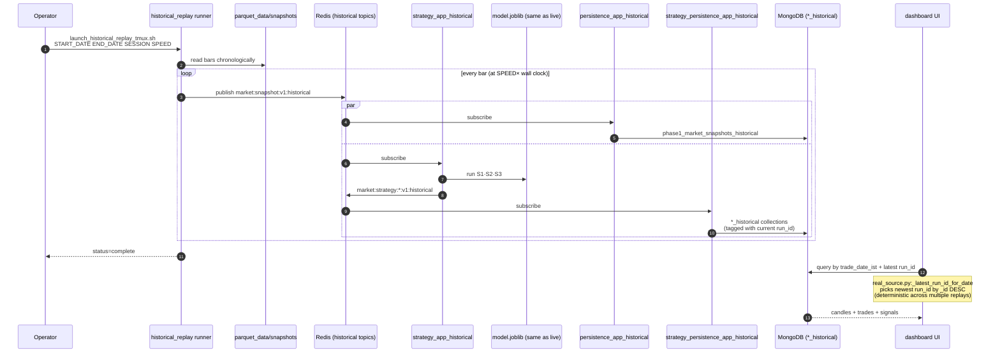
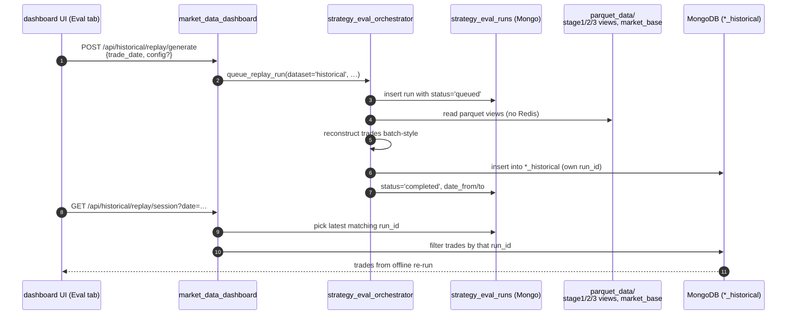

# System Flow Diagrams

End-to-end visual reference for the three lanes — **training**, **live**, and **historical replay / backtest** — plus the eval-orchestrator override. Companion to [ARCHITECTURE.md](ARCHITECTURE.md), which holds the textual cross-cutting view.

Diagrams use Mermaid. Sequence diagrams render top-to-bottom in time order, so reading them feels like watching the flow execute.

> **Viewing tip:** GitHub renders these natively. In VS Code, install the
> [`bierner.markdown-mermaid`](https://marketplace.visualstudio.com/items?itemName=bierner.markdown-mermaid) extension (already in `.vscode/extensions.json` recommendations) and reload. Without it, you'll see the raw `sequenceDiagram` / `flowchart` source instead of rendered diagrams.

---

## 1. Overall Topology

Three lanes share the same `strategy_app` code and the same published model bundle. They differ only in **source** (live ticks vs. replayed bars), **topic suffix** (`:v1` vs `:v1:historical`), and **collection suffix** (`strategy_positions` vs `strategy_positions_historical`).

```mermaid
flowchart LR
    subgraph SRC["Data Sources"]
        KC["KiteConnect WS<br/>(live ticks)"]
        RAW[("raw archives<br/>BankNifty 2020–2024")]
    end

    subgraph TRAIN["TRAINING — ml VM, batch"]
        direction TB
        SB["snapshot_app builders<br/>raw → snapshots → views"]
        PARQ[("parquet_data/<br/>snapshots, stage1/2/3 views,<br/>market_base")]
        MLP["ml_pipeline_2<br/>staged HPO (S1·S2·S3)<br/>+ publish gates"]
        GHCR[("GHCR + GCS<br/>image: market_data_dashboard:tag<br/>artifact: published_models/…")]
        RAW --> SB --> PARQ --> MLP --> GHCR
    end

    subgraph LIVE["LIVE — runtime VM, streaming"]
        direction TB
        ING["ingestion_app"]
        REDIS_L[/"Redis<br/>market:snapshot:v1"/]
        SA_L["strategy_app<br/>(ml_pure engine + regime_gate_v1)"]
        REDIS_S[/"Redis<br/>market:strategy:{votes,signals,positions}:v1"/]
        PA_L["persistence_app<br/>strategy_persistence_app"]
        MONGO_L[("MongoDB<br/>trade_signals,<br/>strategy_positions,<br/>strategy_votes")]
        KC --> ING --> REDIS_L --> SA_L --> REDIS_S --> PA_L --> MONGO_L
    end

    subgraph HIST["HISTORICAL REPLAY — runtime VM, streaming"]
        direction TB
        RR["historical_replay runner<br/>parquet → Redis at N×"]
        REDIS_H[/"Redis<br/>market:snapshot:v1:historical"/]
        SA_H["strategy_app_historical<br/>(same engine as live)"]
        REDIS_SH[/"Redis<br/>market:strategy:*:v1:historical"/]
        PA_H["persistence_app_historical"]
        MONGO_H[("MongoDB<br/>*_historical collections")]
        PARQ -.->|"snapshots + views"| RR
        RR --> REDIS_H --> SA_H --> REDIS_SH --> PA_H --> MONGO_H
    end

    subgraph UI["DASHBOARD — runtime VM"]
        DASH["market_data_dashboard<br/>FastAPI + React"]
        EVAL["strategy_eval_orchestrator<br/>(offline re-run, Flow 3)"]
    end

    GHCR -.->|"ML_PURE_RUN_ID<br/>model.joblib"| SA_L
    GHCR -.->|"same bundle"| SA_H
    MONGO_L -->|"live tab"| DASH
    MONGO_H -->|"replay tab"| DASH
    PARQ -.->|"on-demand"| EVAL --> MONGO_H
    DASH -->|"eval tab triggers"| EVAL
```

**Three things to notice:**
1. `strategy_app` code is **identical** in both runtime instances. Only topic and collection suffixes differ — full live-fidelity replay.
2. The **published model artifact is shared**: same `model.joblib` loaded by both `strategy_app` and `strategy_app_historical`.
3. **Flow 3** (eval orchestrator) is the only path that reads parquet directly without going through Redis. It's the experimental override for ad-hoc re-runs with custom configs.

---

## 2. Training Lane (sequence)

What happens when an operator launches `ml-pipeline-research` with a staged manifest.

The job is fully offline. No live traffic interacts with training. The handoff to runtime is a single environment variable change (`ML_PURE_RUN_ID`) plus the published artifact in GCS.

---

## 3. Live Trading Lane (sequence)

One 1-minute bar, end to end.

The model runs **per bar** in temporal order. No look-ahead by construction — feature windows are appended bar by bar.

---

## 4. Historical Replay Lane (sequence)

The same flow as live, but driven by a synthetic source. Used for backtesting C1 on 2024 data and for validating new model candidates before promotion.

The `strategy_app` code is byte-for-byte the same as the live container. Only the input topic and the persistence suffix differ. This is the architectural decision that gives the replay full live-fidelity — no separate "backtest engine" to drift out of sync.

---

## 5. Eval Orchestrator (Flow 3 override)

The experimental path. Reads parquet directly and re-computes trades without going through Redis. Used when an operator wants to re-run a specific date with a different config (different `min_confidence`, different model bundle, etc.) without disturbing the streaming pipeline.

This is "Flow 3" in the lane taxonomy. It exists to support eval-tab experimentation. Earlier versions wired its trigger into the replay screen, which caused confusion; that button has since been removed — replay reads from Flow 2 streaming output, eval-tab reads from Flow 3.

---

## 6. Three-Lane Comparison

Same model, three execution patterns.

| Aspect | Training | Live | Historical Replay | Eval (Flow 3) |
|---|---|---|---|---|
| Driver | manual / cron | KiteConnect ticks | replay runner | UI button |
| Pacing | offline batch | real time | N× wall clock | as fast as compute |
| Source | parquet | Redis live topic | Redis historical topic | parquet (direct) |
| ML code path | `ml_pipeline_2.staged.pipeline` | `strategy_app.main` | `strategy_app.main` (same) | `strategy_eval_orchestrator` |
| Output | `model.joblib` + reports | `*` Mongo collections | `*_historical` collections | `*_historical` (own run_id) |
| Persists `run_id`? | yes (in artifact path) | yes | yes (per replay launch) | yes (own UUID) |
| Used for | producing C1, C2, D2, E2… | production trading | C1/E2 evaluation on 2024 | custom-config re-runs |

---

## 7. Where to Look in Code

| Concern | File(s) |
|---|---|
| Live snapshot publish | `snapshot_app/`, `ingestion_app/` |
| Live ML inference | `strategy_app/main.py`, `strategy_app/engines/pure_ml_engine.py` |
| Historical replay runner | `snapshot_app/historical/replay_runner.py` |
| Mongo persistence | `persistence_app/main_snapshot_consumer.py`, `persistence_app/main_strategy_consumer.py` |
| Training pipeline | `ml_pipeline_2/src/ml_pipeline_2/staged/pipeline.py` |
| Publish gates | `ml_pipeline_2/src/ml_pipeline_2/staged/release.py` |
| UI session builder | `market_data_dashboard/real_source.py:_build_session` |
| Run-id defaulting | `market_data_dashboard/real_source.py:_latest_run_id_for_date` |
| Eval orchestrator | `strategy_eval_orchestrator/` |

---

## 8. Operational Notes

- **Live and historical Redis topics are isolated** by suffix. Cross-contamination would be a bug.
- **`STRATEGY_ML_PURE_BYPASS_GATES=1`** disables the deterministic gates (e.g. `regime_gate_v1`) but does NOT disable Stage 2/3 ML decisions. For a true Stage-1-only ablation, a code change in `strategy_app.engines.pure_ml_engine` is required.
- **Multiple replays on the same date accumulate in Mongo** — each replay gets its own `run_id`. The UI deterministically picks the most recently inserted run (sort by `_id` DESC). Old runs remain for audit.
- **Publish gate failures are common.** D2 and E2 both completed full training but failed combined gates. The publish path explicitly preserves artifacts for HELD runs so they can be inspected.

---

## 9. Related Docs

- [ARCHITECTURE.md](ARCHITECTURE.md) — textual cross-cutting view
- [SYSTEM_SOURCE_OF_TRUTH.md](SYSTEM_SOURCE_OF_TRUTH.md) — single-source-of-truth for contracts and constants
- [PROCESS_TOPOLOGY.md](PROCESS_TOPOLOGY.md) — runtime process and container layout
- [UI_ARCHITECTURE.md](UI_ARCHITECTURE.md) — dashboard frontend structure
- [../ml_pipeline_2/docs/architecture.md](../ml_pipeline_2/docs/architecture.md) — training pipeline internals
- [../ml_pipeline_2/docs/training/INDEX.md](../ml_pipeline_2/docs/training/INDEX.md) — research history (A→B→C→D→E grids)
- [../strategy_app/docs/STRATEGY_ML_FLOW.md](../strategy_app/docs/STRATEGY_ML_FLOW.md) — ML engine internals (per-bar decision flow)
