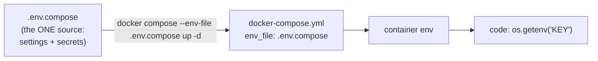
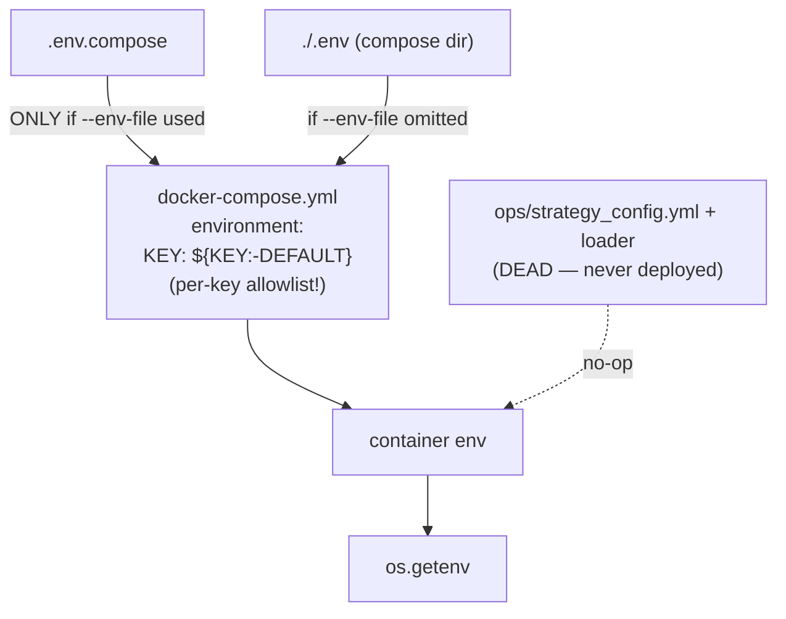

# Config — ONE source, plain and simple

> The single doc for how configuration works. If anything else (old docs, code
> comments) disagrees, **this wins**. Goal: never be confused about "where do I
> set X" again.

---

## TL;DR — the only rule

**All strategy config + secrets live in ONE file: `/opt/option_trading/.env.compose`.**
To change anything: edit that file, then recreate the service **with `--env-file`**:

```bash
cd /opt/option_trading
# edit .env.compose  (e.g. set ML_ENTRY_DIRECTION_MODE=checklist)
sudo docker compose --env-file .env.compose up -d strategy_app
```

That's it. One file, one command.

---

## The flow (target — what we are standardising on)



One file in, straight through to the code. No second source, no precedence rules.

---

## The current reality (what bites us — being fixed, see §Cleanup)



Three traps this caused:
1. **`docker compose up` without `--env-file .env.compose`** → `.env.compose` ignored → the `${KEY:-DEFAULT}` defaults apply (e.g. `composite`, and the `capped_live`+`1.0` combo that **crash-looped** strategy_app).
2. A key only reaches the container if it's listed in the compose `environment:` block **and** set in `.env.compose` (double-entry).
3. `ops/strategy_config.yml` + `strategy_app/config/loader.py` look authoritative but are **dead** (the yaml isn't in the container) — pure confusion.

---

## How to change a setting (step-wise)

1. `ssh` to the runtime VM.
2. Edit `/opt/option_trading/.env.compose` → set `KEY=value`.
3. (Only if it's a brand-new key) add it to the `strategy_app` `environment:` block in
   `docker-compose.yml` as `KEY: "${KEY:-<safe_default>}"`. *(After the env_file cleanup below, this step disappears.)*
4. `cd /opt/option_trading && sudo docker compose --env-file .env.compose up -d strategy_app`
5. Verify: `sudo docker exec option_trading-strategy_app-1 env | grep KEY`

---

## How to deploy / recreate safely

- **Always** `--env-file .env.compose`. A plain `up` falls back to defaults.
- Defaults in `docker-compose.yml` are now **safe** (`STRATEGY_ROLLOUT_STAGE=paper`,
  multiplier `0.25`) so even a forgotten `--env-file` can't crash or arm real money.
- Code is baked in the image. If you `docker cp` a hot-fix, it is **lost on recreate** —
  rebuild the image for anything durable.

---

## Shadow setup (checklist council + selection gate) — step-wise

In `.env.compose` set, then recreate with `--env-file`:
```
ML_ENTRY_DIRECTION_MODE=checklist
OPPORTUNITY_GATE_ENABLED=1
ENTRY_VOL_GATE_ENABLED=0
ENTRY_ML_MIN_PROB=0.0
STRATEGY_MIN_CONFIDENCE=0.0     # else the confidence gate zeros all trades at threshold-0
DIR_COUNCIL_MIN_AGREE=2
DIR_COUNCIL_USE_MODEL=0
```
(Real money stays OFF: `execution_app` is down + paper.)

---

## Cleanup — what we are removing (so nothing "doesn't make sense")

| Remove / fix | Why |
|---|---|
| `ops/strategy_config.yml` + `strategy_app/config/loader.py` bootstrap in `main.py` | dead second source (never deployed); could silently override `.env.compose` if ever mounted. Keep `registry.py` ONLY for the sim override allowlist. |
| Unsafe compose defaults `${STRATEGY_ROLLOUT_STAGE:-capped_live}`, multiplier `:-1.0` | crash-loops on recreate; arms capped_live by accident. → `:-paper`, `:-0.25`. |
| Per-key `environment:` block (double-entry) | replace with `env_file: - .env.compose` so `.env.compose` is the TRUE single source (no per-key mapping). |

After cleanup: **one file (`.env.compose`), one command (`--env-file .env.compose up`), one diagram.** Nothing else to remember.
