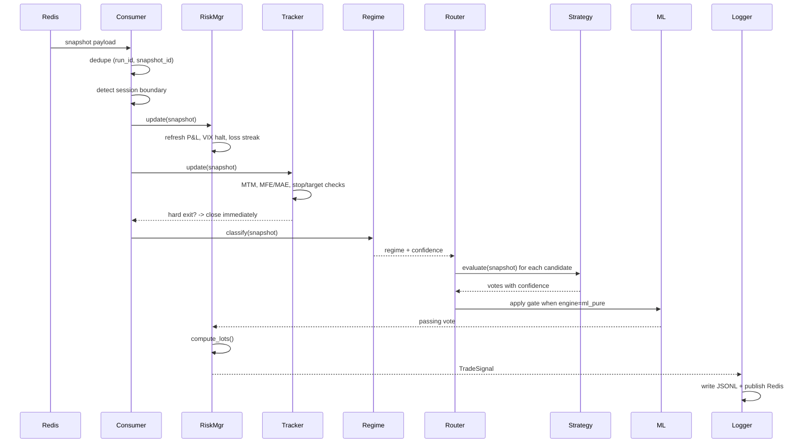
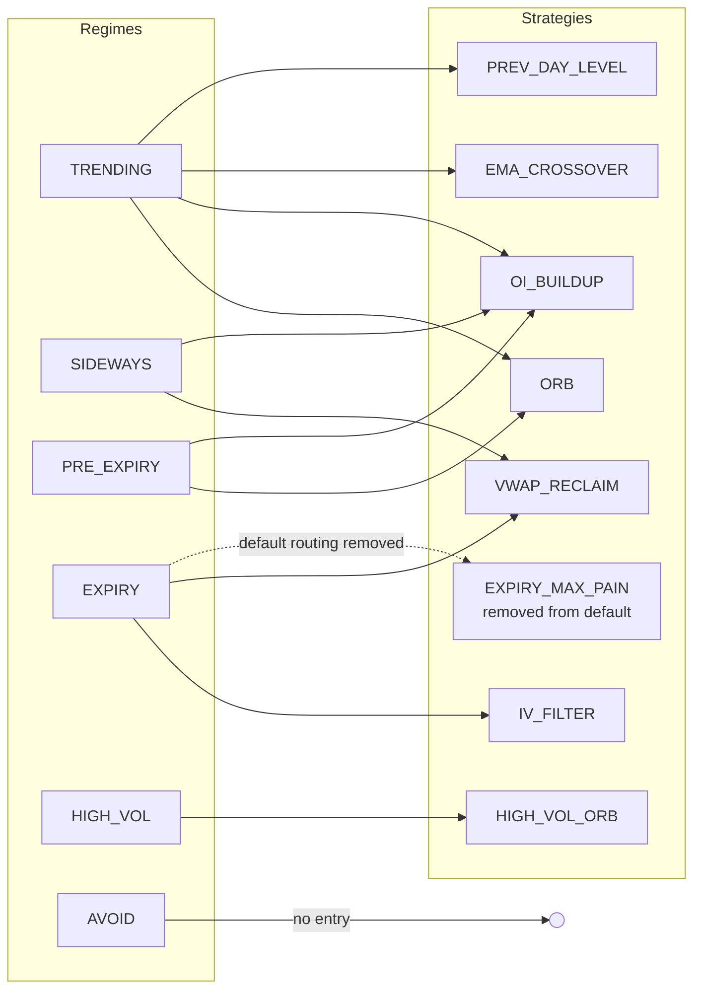
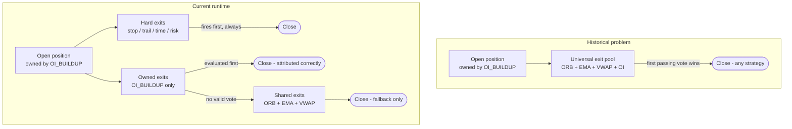
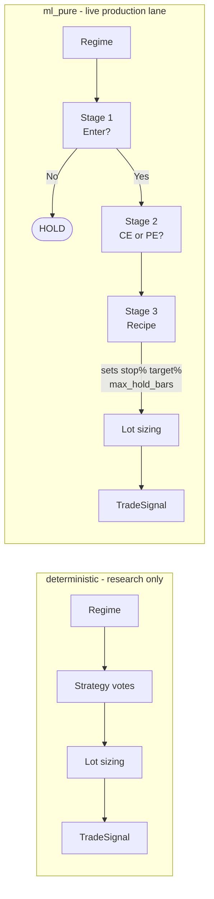
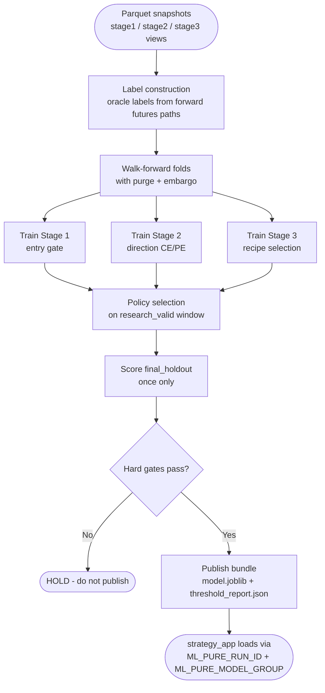
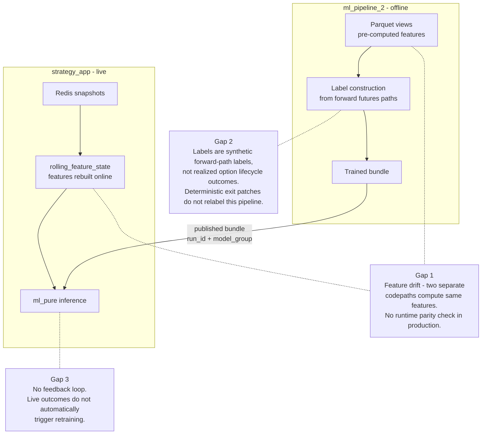
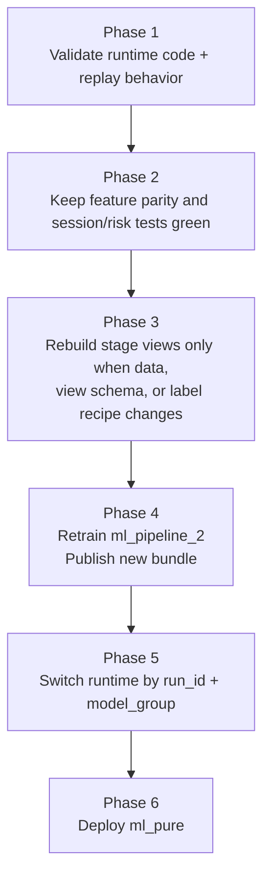

# Strategy + ML Flow

How a single market snapshot moves through `strategy_app` and becomes a trade decision.

---

## 1. Full pipeline - one snapshot, one decision

---

## 2. Per-snapshot decision sequence

---

## 3. Regime -> strategy routing

---

## 4. Exit routing - before and after B1

---

## 5. Current engine lanes

Legacy `ml` wrapper and registry-backed `ml_entry` overlay have been removed from the runtime path.

---

## 6. ML training pipeline (offline)

`ml_pipeline_2` runs offline. It produces the `.joblib` bundle that `strategy_app` loads at startup.

---

## 7. ML <-> strategy integration gaps

---

## 8. Correct order of operations

---

## Reference

| File | Purpose |
|---|---|
| `strategy_app/engines/deterministic_rule_engine.py` | Core decision loop |
| `strategy_app/engines/strategy_router.py` | Regime -> strategy mapping |
| `strategy_app/engines/strategies/all_strategies.py` | All strategy implementations |
| `strategy_app/risk/manager.py` | Lot sizing, halts, drawdown |
| `strategy_app/position/tracker.py` | Position state, hard exits |
| `strategy_app/runtime/redis_snapshot_consumer.py` | Snapshot intake, session lifecycle |
| `ml_pipeline_2/staged/pipeline.py` | ML training orchestration |
| `ml_pipeline_2/staged/publish.py` | Bundle publish and env handoff |
| `strategy_app/docs/ENGINE_CONSOLIDATION_PLAN.md` | Consolidation and handoff status |
