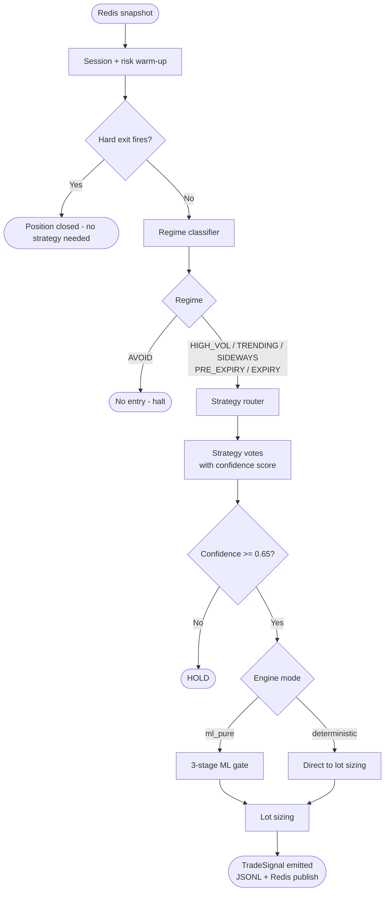
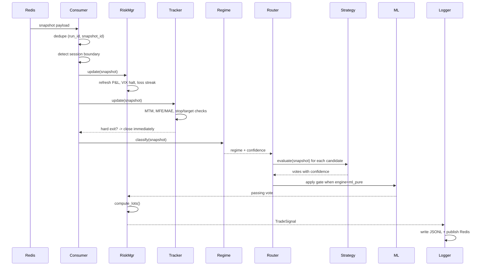
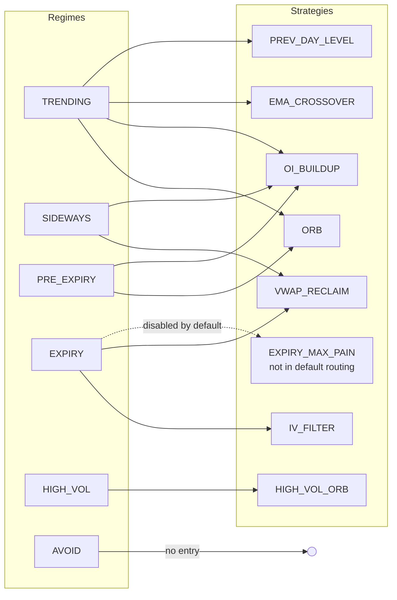
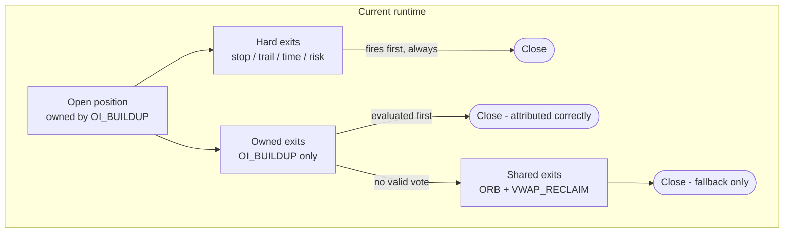
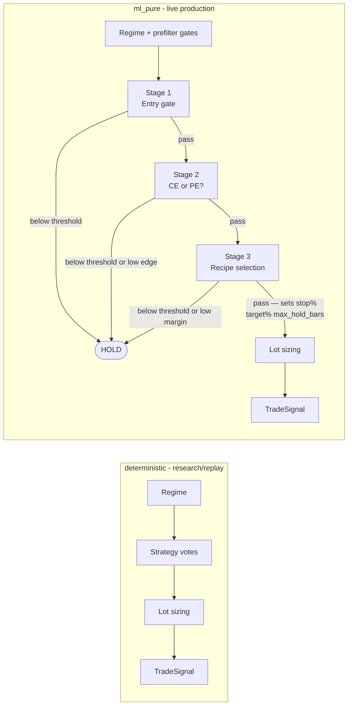
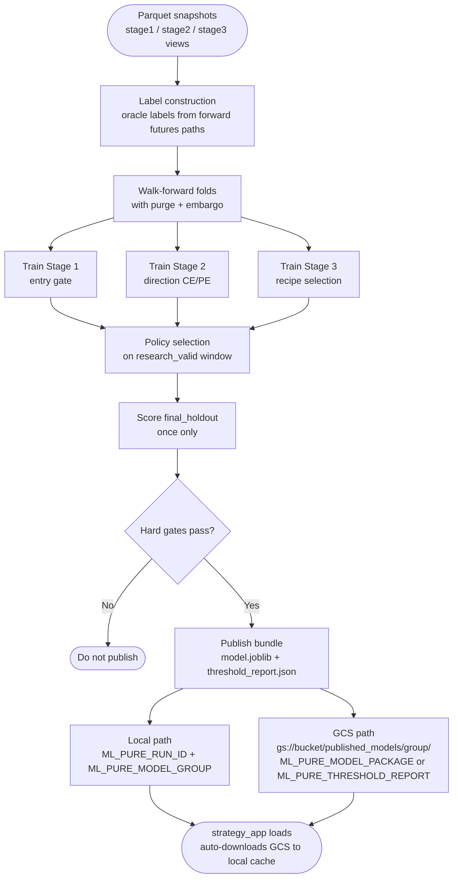
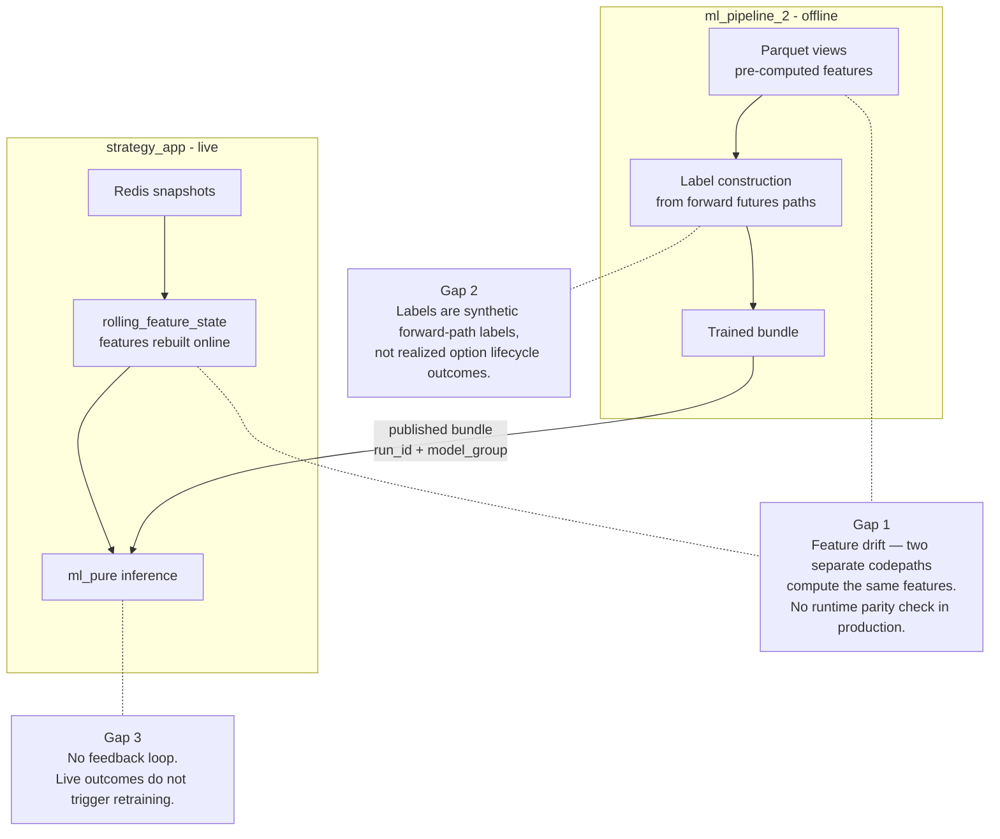
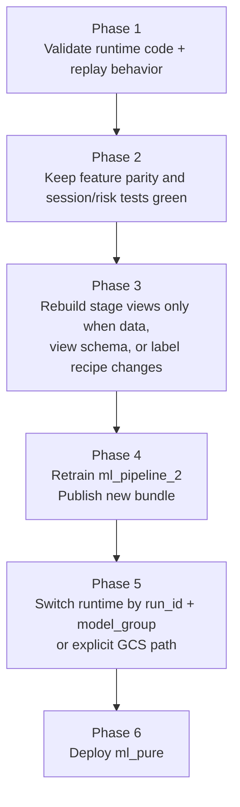

# Strategy + ML Flow

As-of: `2026-04-27`

How a single market snapshot moves through `strategy_app` and becomes a trade decision.

---

## 1. Full pipeline — one snapshot, one decision

---

## 2. Per-snapshot decision sequence

---

## 3. Regime → strategy routing

---

## 4. Exit routing

EMA_CROSSOVER is not in the default universal exit candidate set.

---

## 5. Engine lanes

The legacy `ml` wrapper has been removed. Only `deterministic` and `ml_pure` are supported.

---

## 6. ml_pure staged inference detail

`predict_staged()` in `pure_ml_staged_runtime.py` runs this sequence on each snapshot:

1. **Prefilter chain** — gates from `bundle.runtime.prefilter_gate_ids`:
   - `risk_halt_pause_v1`: halt if risk manager is halted or paused
   - `valid_entry_phase_v1`: block if outside valid session phase
   - `startup_warmup_v1`: block during warmup window
   - `feature_freshness_v1`: block if snapshot age exceeds `max_feature_age_sec`
   - `regime_gate_v1` / `regime_confidence_gate_v1`: block on `AVOID`, `SIDEWAYS`, low-confidence regime, or `EXPIRY` when `block_expiry=true`
   - `feature_completeness_v1`: block if NaN count in required features exceeds `max_nan_features`
   - `liquidity_gate_v1`: block if OI or volume below minimums

2. **Stage 1** — score `entry_prob` against `stage1.selected_threshold`. HOLD if below.

3. **Stage 2** — score `direction_up_prob`. Apply per-direction thresholds and `min_edge`. HOLD on conflict or both below threshold.

4. **Stage 3** — score all recipe models; select top recipe. HOLD if `top_prob < selected_threshold` or `margin < selected_margin_min`. Recipe metadata sets `stop_loss_pct`, `target_pct`, `horizon_minutes`.

`STRATEGY_ML_PURE_BYPASS_GATES=true` skips all prefilter and threshold gates (research use only).

---

## 7. ML training pipeline (offline)

`ml_pipeline_2` runs offline and produces the `.joblib` bundle that `strategy_app` loads at startup.

Current published model: `gs://amittrading-493606-option-trading-models/published_models/research/staged_simple_s2_v1/`

---

## 8. GCS artifact loading

`strategy_app/utils/gcs_artifact.py` provides transparent `gs://` resolution:

- `resolve_artifact_path(path)` — pass-through for local paths; downloads and caches for `gs://` paths
- `download_gcs_file(gcs_url)` — downloads to `GCS_ARTIFACT_CACHE_DIR` (default `~/.cache/option_trading_models/`)
- Cache key is a SHA-256 slug of the full URL; existing cache entries are reused without re-download

`load_staged_model_package()` and `load_staged_policy()` both call `resolve_artifact_path` internally, so `gs://` paths work transparently with no caller changes.

---

## 9. ML ↔ strategy integration gaps

---

## 10. Correct order of operations

---

## Reference

| File | Purpose |
|---|---|
| `strategy_app/engines/deterministic_rule_engine.py` | Core deterministic decision loop |
| `strategy_app/engines/pure_ml_engine.py` | ml_pure engine |
| `strategy_app/engines/pure_ml_staged_runtime.py` | Staged inference: `predict_staged()`, loaders |
| `strategy_app/engines/strategy_router.py` | Regime → strategy mapping |
| `strategy_app/risk/manager.py` | Lot sizing, halts, drawdown |
| `strategy_app/position/tracker.py` | Position state, hard exits |
| `strategy_app/runtime/redis_snapshot_consumer.py` | Snapshot intake, session lifecycle |
| `strategy_app/utils/gcs_artifact.py` | GCS download/cache — resolves `gs://` paths |
| `ml_pipeline_2/staged/pipeline.py` | ML training orchestration |
| `ml_pipeline_2/publishing/release.py` | GCS sync |
